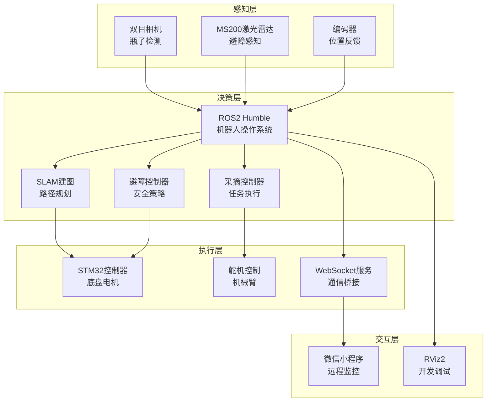

# AgriSage 智能农业采摘机器人系统

  

## 📖 系统概述

AgriSage（农业智者）是一套完整的智能农业采摘机器人解决方案，采用多平台协同架构，集成了机器人感知、控制、导航、通信和人机交互等核心功能。系统基于ROS2 Humble框架开发，支持自主导航、智能避障、精确采摘和远程监控等先进功能。

### 🎯 核心特性

- **🤖 智能感知** - 基于双目视觉的瓶子检测与跟踪
- **🛡️ 安全避障** - MS200激光雷达实时障碍物检测
- **🗺️ 自主导航** - SLAM建图与路径规划
- **📱 远程控制** - 微信小程序实时监控与操作
- **⚡ 高性能** - STM32嵌入式系统精确控制
- **🔄 多模式** - 手动控制与自动采摘无缝切换

## 🏗️ 系统架构



## 📁 项目结构

```
AgriSage/
├── 📱 微信小程序/              # 远程控制界面
│   └── miniprogram/
│       ├── pages/             # 小程序页面
│       │   ├── control/       # 机器人控制中心
│       │   ├── statistics/    # 数据统计分析  
│       │   ├── chat/          # AI智能助手
│       │   └── settings/      # 系统设置
│       ├── components/        # 组件库
│       ├── utils/             # 工具函数
│       └── app.js            # 应用入口与WebSocket通信
│
├── 🤖 robot_ROS2-6_9/          # ROS2机器人系统
│   ├── src/
│   │   ├── bottle_detection_ros2/  # 主功能包
│   │   │   ├── bottle_detection_ros2/  # 核心节点
│   │   │   ├── config/        # 配置参数
│   │   │   ├── launch/        # 启动文件
│   │   │   ├── scripts/       # 脚本工具
│   │   │   └── rviz/          # 可视化配置
│   │   └── bottle_detection_msgs/  # 消息定义
│   ├── LIDAR_INTEGRATION_README.md  # 激光雷达集成指南
│   └── SLAM_MAPPING_README.md       # SLAM建图说明
│
├── 🔧 stm32/                   # 嵌入式控制系统
│   └── mytest_ABlun_/          # STM32项目文件
│
├── 📚 资料/                    # 技术文档
│   ├── ELF 2开发板硬件教程.pdf
│   └── RDK_X5_Product_Brief_V1.0_2.pdf
│
└── README.md                   # 本文档
```

## 🚀 快速开始

### 📋 系统要求

#### 硬件需求
- **主控制器**: 支持ROS2的Linux系统(推荐Ubuntu 22.04)
- **激光雷达**: MS200激光雷达
- **相机**: 双目立体相机
- **嵌入式**: STM32开发板
- **通信**: WiFi/以太网连接

#### 软件依赖
- **ROS2 Humble** (推荐LTS版本)
- **Python 3.8+**
- **OpenCV 4.x**
- **微信开发者工具**

### 🔧 安装配置

#### 1. ROS2环境配置

```bash
# 安装ROS2 Humble
sudo apt update
sudo apt install ros-humble-desktop

# 安装必要依赖包
sudo apt install -y \
    ros-humble-slam-toolbox \
    ros-humble-nav2-* \
    ros-humble-tf2-ros \
    ros-humble-rviz2 \
    ros-humble-sensor-msgs \
    ros-humble-geometry-msgs

# 配置环境变量
echo "source /opt/ros/humble/setup.bash" >> ~/.bashrc
source ~/.bashrc
```

#### 2. 工作空间构建

```bash
# 克隆项目
cd ~/
git clone [your-repo-url] AgriSage
cd AgriSage/robot_ROS2-6_9

# 编译项目
colcon build --symlink-install
source install/setup.bash
```

#### 3. 设备权限配置

```bash
# 激光雷达设备权限
sudo cp oradar.rules /etc/udev/rules.d/
sudo udevadm control --reload-rules
sudo udevadm trigger

# 串口设备权限
sudo usermod -a -G dialout $USER
# 需要重新登录生效
```

#### 4. 微信小程序配置

1. 打开微信开发者工具
2. 导入 `微信小程序/miniprogram` 项目
3. 配置服务器地址（app.js中的serverUrl）
4. 上传代码到微信平台

## 🎮 使用说明

### 🚁 系统启动

#### 快速启动（推荐）

```bash
cd AgriSage/robot_ROS2-6_9
# 启动完整系统（包含避障功能）
./src/bottle_detection_ros2/scripts/start_agrisage_with_lidar.sh

# 启动SLAM建图功能
./src/bottle_detection_ros2/scripts/start_slam_mapping.sh
```

#### 模块化启动

```bash
# 仅启动视觉检测
ros2 launch bottle_detection_ros2 bottle_detection.launch.py

# 启动避障控制
ros2 launch bottle_detection_ros2 laser_avoidance.launch.py

# 启动WebSocket桥接
ros2 run bottle_detection_ros2 websocket_bridge_node
```

### 📱 微信小程序操作

#### 功能模块

1. **🎛️ 控制中心**
   - 手动遥控：方向控制、速度调节
   - 自动模式：一键启动自动采摘
   - 实时视频：机器人视角实时传输
   - 状态监控：电池、信号、连接状态

2. **📊 数据统计**
   - 实时定位：GPS轨迹显示
   - 作业统计：采摘数量、覆盖面积
   - 历史记录：工作日志查询
   - 性能分析：效率指标展示

3. **🤖 AI助手**
   - 智能问答：设备使用指导
   - 故障诊断：问题自动识别
   - 维护提醒：保养计划建议

4. **⚙️ 系统设置**
   - 连接配置：WiFi、服务器设置
   - 参数调节：速度、精度参数
   - 安全设置：紧急停止、权限管理

#### 操作流程

```
开机 → 连接WiFi → 启动小程序 → 连接机器人 → 选择模式 → 开始作业
```

### 🗺️ SLAM建图操作

#### 建图流程

```bash
# 1. 启动建图系统
ros2 launch bottle_detection_ros2 slam_mapping.launch.py

# 2. 开始建图
ros2 service call /slam/start_mapping std_srvs/srv/SetBool "{data: true}"

# 3. 遥控移动机器人完成环境扫描

# 4. 保存地图
ros2 service call /slam/save_map std_srvs/srv/Empty

# 5. 停止建图
ros2 service call /slam/start_mapping std_srvs/srv/SetBool "{data: false}"
```

#### 地图文件位置

```
~/agrisage3_maps/
├── map_YYYYMMDD_HHMMSS.yaml  # 地图元数据
├── map_YYYYMMDD_HHMMSS.pgm   # 地图图像文件
└── latest_map.yaml           # 最新地图链接
```

## ⚙️ 配置参数

### 🎯 视觉检测参数

```yaml
# config/bottle_detection_params.yaml
bottle_detector:
  ros__parameters:
    confidence_threshold: 0.7    # 检测置信度阈值
    nms_threshold: 0.4          # 非极大值抑制阈值
    target_distance: 1.0        # 目标距离(米)
    approach_speed: 0.3         # 接近速度(m/s)
```

### 🛡️ 避障参数

```yaml
# config/laser_avoidance_params.yaml
laser_obstacle_avoidance:
  ros__parameters:
    response_distance: 1.2      # 响应距离(米)
    danger_distance: 0.6        # 危险距离(米)
    emergency_distance: 0.3     # 紧急停止距离(米)
    max_linear_speed: 0.5       # 最大线速度(m/s)
    max_angular_speed: 1.0      # 最大角速度(rad/s)
```

### 🎛️ 运行时参数调整

```bash
# 调整避障响应距离
ros2 param set /laser_obstacle_avoidance response_distance 1.5

# 调整检测置信度
ros2 param set /bottle_detector confidence_threshold 0.8

# 启用/禁用避障功能
ros2 param set /laser_obstacle_avoidance avoidance_enabled true
```

## 🔧 开发指南

### 📡 话题接口

#### 核心话题

```bash
# 激光雷达数据
/scan                    # sensor_msgs/LaserScan

# 运动控制
/cmd_vel                 # geometry_msgs/Twist (最终控制指令)
/cmd_vel_raw            # geometry_msgs/Twist (原始控制指令)

# 视觉检测
/bottle_detections      # bottle_detection_msgs/BoundingBoxes
/image_raw              # sensor_msgs/Image

# SLAM相关
/map                    # nav_msgs/OccupancyGrid
/robot_pose             # geometry_msgs/PoseStamped

# WebSocket桥接
/websocket/send         # std_msgs/String
/websocket/receive      # std_msgs/String
```

#### 服务接口

```bash
# SLAM控制
/slam/start_mapping     # std_srvs/SetBool
/slam/save_map          # std_srvs/Empty

# 系统控制
/emergency_stop         # std_srvs/SetBool
/reset_system          # std_srvs/Empty
```

### 🔌 API接口

#### WebSocket消息格式

```json
{
  "type": "control_command",
  "robot_id": "robot_123",
  "data": {
    "linear_x": 0.5,
    "angular_z": 0.0,
    "mode": "manual"
  },
  "timestamp": 1640995200000
}
```

#### 状态更新消息

```json
{
  "type": "status_update",
  "data": {
    "battery_level": 85,
    "position": {"x": 1.2, "y": 0.8, "theta": 0.5},
    "operation_mode": "auto",
    "safety_status": "normal"
  }
}
```

### 🧩 自定义节点开发

#### Python节点模板

```python
#!/usr/bin/env python3
import rclpy
from rclpy.node import Node

class CustomNode(Node):
    def __init__(self):
        super().__init__('custom_node')
        # 初始化代码
        
    def main():
        rclpy.init()
        node = CustomNode()
        rclpy.spin(node)
        rclpy.shutdown()

if __name__ == '__main__':
    main()
```

## 🛠️ 维护指南

### 📊 系统监控

#### 实时状态检查

```bash
# 查看系统整体状态
ros2 node list
ros2 topic list

# 检查话题数据流
ros2 topic hz /scan
ros2 topic hz /cmd_vel

# 查看节点计算图
rqt_graph
```

#### 日志分析

```bash
# 查看节点日志
ros2 log info
ros2 log warn

# 检查特定节点
ros2 run rqt_console rqt_console
```

### 🔧 常见问题排查

#### 连接问题

```bash
# 检查设备连接
ls -l /dev/ttyUSB*
ls -l /dev/oradar

# 检查网络连接
ping [服务器IP]
netstat -an | grep 1234
```

#### 性能问题

```bash
# 检查CPU使用率
htop

# 检查ROS2节点资源占用
ros2 run resource_monitor monitor_node

# 内存使用情况
free -h
```

### 🔄 更新升级

#### 系统更新

```bash
# 更新ROS2包
sudo apt update && sudo apt upgrade

# 重新编译工作空间
cd AgriSage/robot_ROS2-6_9
colcon build --symlink-install
```

#### 配置备份

```bash
# 备份配置文件
cp -r config/ config_backup_$(date +%Y%m%d)

# 备份地图文件
cp -r ~/agrisage3_maps/ ~/maps_backup_$(date +%Y%m%d)
```

## 🚨 安全说明

### ⚠️ 操作安全

1. **环境检查**: 确保作业区域无人员和障碍物
2. **紧急停止**: 随时准备使用紧急停止功能
3. **通信监控**: 确保通信连接稳定
4. **电池管理**: 监控电池电量，及时充电

### 🔒 数据安全

1. **网络安全**: 使用安全的WiFi连接
2. **数据加密**: 敏感数据传输加密
3. **访问控制**: 限制系统访问权限
4. **定期备份**: 重要数据定期备份

## 📞 技术支持

### 🐛 问题反馈

- **Issue报告**: [GitHub Issues]
- **技术文档**: `/资料/` 目录
- **API文档**: 查看源码注释

### 🤝 贡献指南

1. Fork项目仓库
2. 创建功能分支: `git checkout -b feature/new-feature`
3. 提交更改: `git commit -am 'Add new feature'`
4. 推送分支: `git push origin feature/new-feature`
5. 提交Pull Request

### 📄 许可证

本项目采用MIT许可证，详见LICENSE文件。

---

## 🎉 更新日志

### v3.0.0 (当前版本)
- ✨ 集成MS200激光雷达避障系统
- 🗺️ 添加SLAM建图与导航功能
- 📱 优化微信小程序界面和性能
- 🔧 重构代码架构，提升系统稳定性

### v2.1.0
- 🤖 优化瓶子检测算法精度
- 📡 改进WebSocket通信稳定性
- 🎯 增加多种工作模式

### v2.0.0
- 🎨 全新的微信小程序界面
- 🚀 基于ROS2 Humble重构系统
- 📊 添加数据统计分析功能

---

<div align="center">

**AgriSage - 让农业更智能** 🌱🤖

[项目主页] | [技术文档] | [演示视频] | [联系我们]

</div>