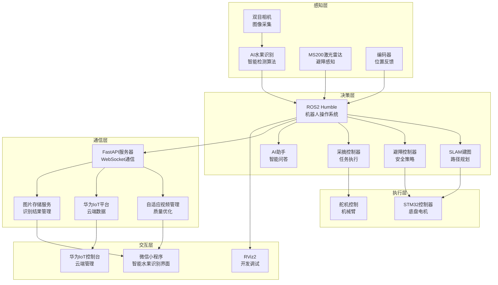

# AgriSage 智能农业水果识别采摘机器人系统

  

## 📖 系统概述

AgriSage（农业智者）是一套完整的智能农业水果识别采摘机器人解决方案，采用多平台协同架构，集成了机器人感知、AI水果识别、智能控制、导航、通信和人机交互等核心功能。系统基于ROS2 Humble框架开发，支持自主导航、智能避障、精确水果识别与采摘、远程监控等先进功能。

### 🎯 核心特性

- **🍎 智能水果识别** - AI驱动的水果检测、成熟度分析、品质评估
- **📸 多模式检测** - 综合检测、成熟度检测、健康检测、品质评估四种模式
- **🤖 智能感知** - 基于双目视觉的目标检测与跟踪
- **🛡️ 安全避障** - MS200激光雷达实时障碍物检测
- **🗺️ 自主导航** - SLAM建图与路径规划
- **📱 远程控制** - 微信小程序实时监控与智能操作
- **☁️ 云端集成** - 华为IoT平台数据上报与远程管理
- **🎥 自适应视频** - 智能视频质量调节与传输优化
- **🤖 AI助手** - 集成智能问答与故障诊断
- **📊 数据分析** - 水果识别历史记录与统计分析
- **⚡ 高性能** - STM32嵌入式系统精确控制
- **🔄 多模式** - 手动控制与自动采摘无缝切换

## 🏗️ 系统架构



## 📁 项目结构

```
AgriSage/
├── 📱 微信小程序/              # 智能水果识别控制界面
│   └── miniprogram/
│       ├── pages/             # 小程序页面
│       │   ├── detection/     # ⭐ 智能水果识别页面（核心功能）
│       │   │   ├── detection.js    # 水果识别核心逻辑
│       │   │   ├── detection.wxml  # 识别界面模板
│       │   │   └── detection.wxss  # 界面样式
│       │   ├── control/       # 机器人控制中心
│       │   ├── statistics/    # 数据统计分析  
│       │   ├── chat/          # AI智能助手
│       │   └── settings/      # 系统设置
│       ├── components/        # 组件库
│       ├── utils/             # 工具函数
│       └── app.js            # 应用入口与WebSocket通信
│
├── 🤖 robot_ROS2-6_9/          # ROS2机器人系统
│   ├── src/
│   │   ├── bottle_detection_ros2/  # 主功能包（支持水果识别）
│   │   │   ├── bottle_detection_ros2/  # 核心节点
│   │   │   ├── config/        # 配置参数
│   │   │   ├── launch/        # 启动文件
│   │   │   ├── scripts/       # 脚本工具
│   │   │   └── rviz/          # 可视化配置
│   │   └── bottle_detection_msgs/  # 消息定义
│   ├── LIDAR_INTEGRATION_README.md  # 激光雷达集成指南
│   └── SLAM_MAPPING_README.md       # SLAM建图说明
│
├── ☁️ 上位机与服务端/            # 智能服务端系统
│   ├── server.py              # ⭐ FastAPI主服务器（含水果识别处理）
│   ├── adaptive_video_manager.py  # 自适应视频管理
│   ├── requirements.txt       # Python依赖包
│   └── fruit_images/          # 水果识别图片存储目录
│
├── 🔧 stm32/                   # 嵌入式控制系统
│   └── mytest_ABlun_/          # STM32项目文件
│
├── 📚 资料/                    # 技术文档
│   ├── ELF 2开发板硬件教程.pdf
│   └── RDK_X5_Product_Brief_V1.0_2.pdf
│
└── README.md                   # 本文档
```

## 🍎 智能水果识别系统

### 🔬 识别功能特性

#### 多模式检测
- **综合检测**: 全方位水果分析，包含所有检测指标
- **成熟度检测**: 专注于水果成熟度评估
- **健康检测**: 病虫害和健康状况识别
- **品质评估**: 外观品质和商业价值评估

#### 识别指标
```javascript
// 水果识别结果数据结构
const detectionResult = {
  fruitType: "红富士苹果",        // 水果类型
  variety: "红富士",              // 品种
  confidence: 95,                 // 识别置信度 (%)
  maturity: 85,                   // 成熟度 (%)
  healthStatus: "健康",           // 健康状况
  qualityScore: 92,               // 品质评分 (0-100)
  appearanceStars: 4,             // 外观星级 (1-5)
  sizeCategory: "中等",           // 尺寸分类
  overallGrade: "Excellent",      // 总体评级
  recommendation: "该苹果成熟度适中，无病虫害，建议立即采摘", // 建议
  suggestedAction: "harvest",     // 建议操作
  boundingBox: {...},             // 检测框位置
  timestamp: 1640995200000        // 检测时间戳
}
```

#### 图像处理能力
- **多源图像**: 支持拍照和相册选择
- **智能压缩**: 自动图像压缩优化传输
- **格式转换**: Base64编码传输
- **缓存管理**: 临时图片文件管理

### 📊 数据统计与分析

#### 实时统计
- **今日检测次数**: 实时统计当日检测数量
- **识别准确率**: 系统识别准确度统计
- **水果类型分布**: 不同水果类型检测统计
- **品质分析**: 优质果率和平均品质分数

#### 历史记录管理
- **检测历史**: 完整的识别记录存储
- **日期筛选**: 支持按日期查看历史记录
- **数据导出**: 识别结果数据导出功能
- **图片管理**: 识别图片的存储和访问

## 🚀 快速开始

### 📋 系统要求

#### 硬件需求
- **主控制器**: 支持ROS2的Linux系统(推荐Ubuntu 22.04)
- **激光雷达**: MS200激光雷达
- **相机**: 双目立体相机（支持水果识别）
- **嵌入式**: STM32开发板
- **通信**: WiFi/以太网连接
- **云服务**: 华为云IoT平台账号

#### 软件依赖
- **ROS2 Humble** (推荐LTS版本)
- **Python 3.8+**
- **FastAPI** (Web服务框架)
- **OpenCV 4.x** (图像处理)
- **微信开发者工具**
- **华为IoT设备SDK**
- **AI识别模型** (水果检测算法)

### 🔧 安装配置

#### 1. ROS2环境配置

```bash
# 安装ROS2 Humble
sudo apt update
sudo apt install ros-humble-desktop

# 安装必要依赖包
sudo apt install -y \
    ros-humble-slam-toolbox \
    ros-humble-nav2-* \
    ros-humble-tf2-ros \
    ros-humble-rviz2 \
    ros-humble-sensor-msgs \
    ros-humble-geometry-msgs \
    ros-humble-cv-bridge \
    ros-humble-image-transport

# 配置环境变量
echo "source /opt/ros/humble/setup.bash" >> ~/.bashrc
source ~/.bashrc
```

#### 2. 服务端环境配置

```bash
# 安装Python依赖
cd AgriSage/上位机与服务端
pip install -r requirements.txt

# 主要依赖包
pip install fastapi uvicorn websockets
pip install iot-device-sdk-python
pip install opencv-python numpy pillow
pip install aiofiles pathlib

# 创建图片存储目录
mkdir -p fruit_images
chmod 755 fruit_images
```

#### 3. 华为IoT平台配置

```bash
# 配置IoT平台参数 (在server.py中)
IOT_SERVER_URI = "78c7a8f557.st1.iotda-device.cn-east-3.myhuaweicloud.com"
IOT_DEVICE_ID = "6804c32cfde7ae37459990d1_my_picking_robot"
IOT_SECRET = "71fa98bcd2e07ddd8a4051f2e8c85304"
```

#### 4. 工作空间构建

```bash
# 克隆项目
cd ~/
git clone [your-repo-url] AgriSage
cd AgriSage/robot_ROS2-6_9

# 编译项目
colcon build --symlink-install
source install/setup.bash
```

#### 5. 微信小程序配置

1. 打开微信开发者工具
2. 导入 `微信小程序/miniprogram` 项目
3. 配置服务器地址（app.js中的serverUrl）
4. 配置图片上传和显示服务
5. 上传代码到微信平台

## 🎮 使用说明

### 🍎 智能水果识别操作

#### 1. 启动系统

```bash
# 1. 启动服务端 (必须先启动)
cd AgriSage/上位机与服务端
python server.py
# 服务器将在 http://172.20.39.181:1234 启动
# 图片服务将在 http://172.20.39.181:1234/images/ 提供

# 2. 启动ROS2系统
cd AgriSage/robot_ROS2-6_9
./src/bottle_detection_ros2/scripts/start_agrisage_with_lidar.sh
```

#### 2. 微信小程序操作流程

```
打开小程序 → 进入检测页面 → 选择检测模式 → 
拍照/选择图片 → AI智能识别 → 查看识别结果 → 
执行建议操作 → 查看历史记录
```

#### 3. 水果识别详细步骤

**选择图像源**
- **拍照检测**: 实时拍摄水果照片进行识别
- **相册选择**: 从手机相册选择已有图片
- **批量检测**: 支持多张图片批量识别（规划中）

**设置检测模式**
- **综合检测**: 完整的水果分析报告
- **成熟度检测**: 重点分析果实成熟程度
- **健康检测**: 专注病虫害识别
- **品质评估**: 商业价值评估

**查看识别结果**
```
🍎 苹果识别结果展示
━━━━━━━━━━━━━━━━━━━━━━━━━━━━━━━━━━━━━━━━━━━━━━━━━━━━━━━
📸 源图片: 拍摄_14:30
🕒 检测时间: 2024-01-15 14:30:25
📍 检测位置: 苹果园区3号地块
━━━━━━━━━━━━━━━━━━━━━━━━━━━━━━━━━━━━━━━━━━━━━━━━━━━━━━━
🍏 水果类型: 红富士苹果
🌱 成熟度: 85%
⭐ 品质分数: 92/100
🏥 健康状态: 健康
🎯 识别置信度: 95%
━━━━━━━━━━━━━━━━━━━━━━━━━━━━━━━━━━━━━━━━━━━━━━━━━━━━━━━
💡 采摘建议: 该苹果成熟度适中，无病虫害，建议立即采摘
🎬 建议操作: 立即采摘
━━━━━━━━━━━━━━━━━━━━━━━━━━━━━━━━━━━━━━━━━━━━━━━━━━━━━━━
```

**操作建议执行**
- **立即采摘**: 发送采摘指令给机器人
- **等待观察**: 标记位置，设置提醒时间
- **标记检查**: 记录问题，安排人工检查

### 📊 数据统计功能

#### 识别统计页面
- **今日统计**: 检测次数、优质果率、平均品质
- **历史趋势**: 按日/周/月查看识别数据趋势
- **水果分布**: 不同水果类型的识别统计
- **品质分析**: 品质等级分布图表

#### 历史记录管理
- **记录查询**: 支持日期筛选和关键词搜索
- **结果回顾**: 重新查看历史识别结果
- **数据导出**: 导出统计数据和识别报告
- **图片管理**: 批量管理识别过的图片

## ⚙️ 配置参数

### 🍎 水果识别参数

```yaml
# config/fruit_detection_params.yaml
fruit_detector:
  ros__parameters:
    confidence_threshold: 0.7      # 识别置信度阈值
    maturity_threshold: 0.8        # 成熟度判断阈值
    quality_threshold: 75          # 品质评分阈值
    image_max_size: 1024           # 图片最大尺寸
    compression_quality: 0.8       # 图片压缩质量
    detection_modes:               # 检测模式配置
      - comprehensive              # 综合检测
      - maturity                   # 成熟度检测  
      - health                     # 健康检测
      - quality                    # 品质评估
```

### 🎯 视觉检测参数

```yaml
# config/bottle_detection_params.yaml (支持水果识别)
detector:
  ros__parameters:
    confidence_threshold: 0.7      # 检测置信度阈值
    nms_threshold: 0.4            # 非极大值抑制阈值
    target_distance: 1.0          # 目标距离(米)
    approach_speed: 0.3           # 接近速度(m/s)
    fruit_classes:                # 支持的水果类别
      - apple                     # 苹果
      - pear                      # 梨
      - orange                    # 橙子
      - peach                     # 桃子
```

### ☁️ 服务端配置

```python
# server.py 配置项
SERVER_HOST = "172.20.39.181"      # 服务器地址
SERVER_PORT = 1234                 # 服务器端口

# 图片存储配置
IMAGES_DIR = Path("fruit_images")   # 图片存储目录
MAX_IMAGE_SIZE = 5 * 1024 * 1024   # 最大图片大小 5MB
SUPPORTED_FORMATS = ['jpg', 'jpeg', 'png']  # 支持的图片格式

# 华为IoT平台配置
IOT_SERVER_URI = "78c7a8f557.st1.iotda-device.cn-east-3.myhuaweicloud.com"
IOT_DEVICE_ID = "6804c32cfde7ae37459990d1_my_picking_robot"
IOT_SECRET = "71fa98bcd2e07ddd8a4051f2e8c85304"
```

## 🔧 开发指南

### 📡 水果识别API接口

#### WebSocket消息格式

**水果识别请求**
```json
{
  "type": "ai_fruit_detection",
  "data": {
    "image_base64": "base64编码的图片数据",
    "detection_mode": "comprehensive",
    "robot_id": "robot_123",
    "timestamp": 1640995200000,
    "image_info": {
      "name": "拍摄_14:30",
      "time": "14:30"
    }
  }
}
```

**水果识别响应**
```json
{
  "type": "ai_fruit_detection_response",
  "success": true,
  "result": {
    "fruit_type": "红富士苹果",
    "variety": "红富士",
    "confidence": 95,
    "maturity_percentage": 85,
    "health_status": "健康",
    "health_score": 92,
    "pest_status": "none",
    "disease_status": "none",
    "quality_score": 92,
    "appearance_score": 80,
    "size_category": "中等",
    "overall_score": 90,
    "recommendation": "该苹果成熟度适中，无病虫害，建议立即采摘",
    "suggested_action": "harvest",
    "actionable": true,
    "bounding_box": {
      "x": 100, "y": 50, "width": 200, "height": 150
    }
  },
  "timestamp": 1640995200000
}
```

**水果识别结果通知**
```json
{
  "type": "fruit_detection_result",
  "data": {
    "fruitType": "红富士苹果",
    "maturity": 85,
    "healthStatus": "健康",
    "qualityScore": 92,
    "confidence": 95,
    "recommendation": "建议立即采摘",
    "actionTaken": "待处理",
    "location": "苹果园区3号地块",
    "detectionTime": "14:30:25",
    "source_image": "fruit_robot_123_1640995200000.jpg",
    "imageUrl": "/images/fruit_robot_123_1640995200000.jpg",
    "timestamp": 1640995200000
  }
}
```

**获取识别历史**
```json
{
  "type": "get_detection_history",
  "robot_id": "robot_123",
  "date_filter": "2024-01-15",
  "timestamp": 1640995200000
}
```

### 🖼️ 图片处理API

#### 图片存储服务
```python
# 图片访问URL格式
image_url = f"http://172.20.39.181:1234/images/{image_filename}"

# 支持的图片操作
- 自动压缩和格式转换
- Base64编码/解码
- 缩略图生成
- 批量处理
```

#### 图片管理功能
```python
# 图片文件命名规则
filename_pattern = f"fruit_{robot_id}_{timestamp}.jpg"

# 图片存储路径
storage_path = "fruit_images/"

# 图片清理策略
- 自动清理过期图片
- 压缩存储优化
- 缓存管理
```

### 🔌 微信小程序集成

#### 核心页面：detection.js
```javascript
// 主要功能函数
- handleImageSelected()      // 图片选择处理
- startDetection()          // 开始AI检测
- handleDetectionResponse() // 处理检测结果
- saveDetectionRecord()     // 保存检测记录
- loadLocalData()          // 加载本地数据
- formatDetectionResult()   // 格式化检测结果
```

#### 数据同步机制
```javascript
// 本地存储键名
const STORAGE_KEYS = {
  DETECTION_HISTORY: 'detection_history',
  TODAY_STATS: 'today_detection_stats',
  DETECTION_MODE: 'detection_mode'
};

// 数据同步策略
- 本地存储 + 服务器同步
- 实时数据更新
- 离线数据缓存
- 数据一致性保证
```

## 🛠️ 维护指南

### 📊 水果识别系统监控

#### 识别性能监控
```bash
# 查看识别统计
curl http://172.20.39.181:1234/health

# 检查图片存储服务
ls -la fruit_images/
du -sh fruit_images/

# 监控识别准确率
grep "水果识别完成" server.log | tail -20
```

#### 识别质量分析
```bash
# 分析识别置信度分布
grep "置信度:" server.log | awk '{print $NF}' | sort -n

# 统计水果类型分布  
grep "类型:" server.log | awk '{print $NF}' | sort | uniq -c

# 检查识别错误率
grep "识别失败" server.log | wc -l
```

### 🔧 常见问题排查

#### 识别功能问题

```bash
# 检查AI服务状态
curl -X POST http://172.20.39.181:1234/health \
  -H "Content-Type: application/json"

# 验证图片上传功能
curl -X POST http://172.20.39.181:1234/images/ \
  -F "file=@test_fruit.jpg"

# 检查识别模型加载
grep "模型加载" server.log
```

#### 图片处理问题

```bash
# 检查图片存储权限
ls -la fruit_images/
chmod 755 fruit_images/

# 验证图片访问
curl -I http://172.20.39.181:1234/images/test_image.jpg

# 清理临时图片
find fruit_images/ -name "*.tmp" -delete
```

## 🚨 安全说明

### 🔒 数据安全

1. **图片隐私**: 识别图片仅本地存储，不上传第三方
2. **数据加密**: 敏感识别数据传输加密
3. **访问控制**: 图片访问权限控制
4. **定期清理**: 自动清理过期识别数据
5. **备份策略**: 重要识别记录定期备份

### 🍎 识别安全

1. **模型验证**: 确保AI识别模型的准确性和安全性
2. **结果校验**: 关键识别结果需要人工确认
3. **错误处理**: 完善的错误处理和异常恢复机制
4. **数据校验**: 输入数据格式和内容验证

## 📞 技术支持

### 🐛 问题反馈

- **Issue报告**: [GitHub Issues]
- **水果识别问题**: 查看 `/微信小程序/` 源码和API文档
- **服务端问题**: 查看 `server.py` 注释和日志
- **华为IoT文档**: [华为云IoT设备接入文档]

### 📄 许可证

本项目采用MIT许可证，详见LICENSE文件。

---

## 🎉 更新日志

### v3.1.0 (当前版本)
- 🍎 **核心功能**: 集成完整的智能水果识别系统
- 📸 **多模式检测**: 支持综合检测、成熟度检测、健康检测、品质评估
- 🖼️ **图片处理**: 完善的图片上传、压缩、存储、访问系统
- 📊 **数据管理**: 识别历史记录、统计分析、数据同步
- 🎯 **AI增强**: 高精度水果识别算法集成
- 📱 **小程序优化**: 全新的水果识别交互界面
- ☁️ **云端集成**: 华为IoT平台深度集成
- 🔧 **系统稳定性**: 全面的错误处理和异常恢复

### v3.0.0
- ✨ 集成MS200激光雷达避障系统
- 🗺️ 添加SLAM建图与导航功能
- ☁️ 集成华为IoT平台，支持云端监控和控制
- 🎥 新增自适应视频传输系统
- 🤖 集成AI智能助手功能
- 📊 完善数据统计和历史记录功能
- 📱 优化微信小程序界面和性能
- 🔧 重构代码架构，提升系统稳定性
- 🌐 添加FastAPI服务端，支持WebSocket实时通信

---

<div align="center">

**AgriSage - 让农业更智能** 🌱🤖🍎

**核心特色**: 智能水果识别 | AI品质评估 | 云端数据同步 | 实时远程控制

**技术栈**: ROS2 Humble | FastAPI | WebSocket | 华为IoT | 微信小程序 | STM32 | OpenCV | AI识别算法

</div>