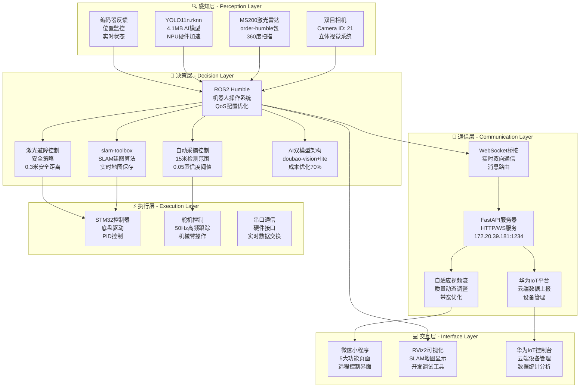

# 🤖 AgriSage 智能农业采摘机器人系统

   

## 📖 项目概述

**AgriSage**（农业智者）是一套完整的智能农业采摘机器人解决方案，集成了计算机视觉、机器人控制、SLAM导航、激光避障、远程通信和AI智能助手等前沿技术。系统基于ROS2 Humble框架开发，采用多层模块化架构设计，支持自主导航、智能避障、精确目标检测与采摘、远程监控等核心功能。

### 🎯 核心特性

- **🍎 智能目标识别** - 基于YOLO11n+RKNN的高精度水果检测，支持15米超远距离检测
- **🎥 双目立体视觉** - 精确的三维空间定位和深度估计，Camera ID: 21
- **🛡️ 激光雷达避障** - MS200激光雷达实时障碍物检测与避障，order-humble包支持
- **🗺️ SLAM建图导航** - 基于slam-toolbox的自主建图与路径规划，实时可视化和地图保存
- **🤖 多模式控制** - 手动控制与自动采摘无缝切换，50Hz高频舵机跟踪
- **📱 微信小程序** - 实时远程监控、控制和水果识别界面，支持地理位置、相机权限
- **🧠 AI智能助手** - 集成豆包双模型架构，成本优化70-80%
- **☁️ 云端集成** - 华为IoT平台数据上报与远程管理，自适应视频管理
- **🎛️ 精确控制** - STM32底层控制，支持机械臂精密操作和编码器反馈
- **📊 数据统计** - 完整的作业数据记录与分析系统，支持历史回放
- **🔧 自动模式优化** - 扩大检测范围、降低置信度阈值、超远距离控制策略
- **🎯 实时性保障** - QoS配置优化、多线程并发处理、错误恢复机制

## 🏗️ 系统架构

### 🏛️ 多层模块化架构设计

系统采用五层模块化架构，实现**感知-决策-通信-执行-交互**的完整闭环：


```mermaid
graph TB
    subgraph "🔍 感知层 - Perception Layer"
        A[双目相机<br/>Camera ID: 21<br/>立体视觉系统]
        B[MS200激光雷达<br/>order-humble包<br/>360度扫描]
        C[YOLO11n.rknn<br/>4.1MB AI模型<br/>NPU硬件加速]
        D[编码器反馈<br/>位置监控<br/>实时状态]
    end
    
    subgraph "🧠 决策层 - Decision Layer"
        E[ROS2 Humble<br/>机器人操作系统<br/>QoS配置优化]
        F[slam-toolbox<br/>SLAM建图算法<br/>实时地图保存]
        G[激光避障控制<br/>安全策略<br/>0.3米安全距离]
        H[自动采摘控制<br/>15米检测范围<br/>0.05置信度阈值]
        I[AI双模型架构<br/>doubao-vision+lite<br/>成本优化70%]
    end
    
    subgraph "📡 通信层 - Communication Layer"
        J[WebSocket桥接<br/>实时双向通信<br/>消息路由]
        K[FastAPI服务器<br/>HTTP/WS服务<br/>172.20.39.181:1234]
        L[华为IoT平台<br/>云端数据上报<br/>设备管理]
        M[自适应视频流<br/>质量动态调整<br/>带宽优化]
    end
    
    subgraph "⚡ 执行层 - Execution Layer"
        N[STM32控制器<br/>底盘驱动<br/>PID控制]
        O[舵机控制<br/>50Hz高频跟踪<br/>机械臂操作]
        P[串口通信<br/>硬件接口<br/>实时数据交换]
    end
    
    subgraph "💻 交互层 - Interface Layer"
        Q[微信小程序<br/>5大功能页面<br/>远程控制界面]
        R[RViz2可视化<br/>SLAM地图显示<br/>开发调试工具]
        S[华为IoT控制台<br/>云端设备管理<br/>数据统计分析]
    end
    
    A --> E
    B --> E
    C --> E
    D --> E
    E --> F
    E --> G
    E --> H
    E --> I
    E --> J
    F --> N
    G --> N
    H --> O
    J --> K
    K --> L
    K --> M
    M --> Q
    L --> S
    E --> R
```

### 🔧 核心节点架构

系统包含**5类核心节点**，实现功能解耦和模块化管理：

- **🔍 Detection节点**: integrated_bottle_detection_node.py（集成检测）、bottle_detection_node_async.py（异步检测）
- **🎮 Control节点**: auto_harvest_controller.py（自动采摘）、robot_control_node.py（机器人控制）、servo_control_node.py（舵机控制）
- **📡 Communication节点**: websocket_bridge_node.py（WebSocket桥接）
- **🗺️ Navigation节点**: slam_mapping_node.py（SLAM建图）
- **🧪 Testing节点**: 各类调试和测试工具

## 📁 项目结构详解

```
AgriSage/
├── 🤖 robot_ROS2-6_9/                    # ROS2主系统
│   ├── src/
│   │   ├── bottle_detection_ros2/        # 主功能包
│   │   │   ├── bottle_detection_ros2/    # 核心模块
│   │   │   │   ├── nodes/               # ROS2节点层
│   │   │   │   │   ├── detection/       # 检测节点
│   │   │   │   │   │   ├── integrated_bottle_detection_node.py  # 🌟 集成检测节点
│   │   │   │   │   │   ├── bottle_detection_node_async.py       # 异步检测节点
│   │   │   │   │   │   └── bottle_detection_node.py             # 基础检测节点
│   │   │   │   │   ├── control/         # 控制节点
│   │   │   │   │   │   ├── auto_harvest_controller.py           # 🌟 自动采摘控制器
│   │   │   │   │   │   ├── robot_control_node.py               # 机器人控制
│   │   │   │   │   │   ├── servo_control_node.py               # 舵机控制
│   │   │   │   │   │   └── servo_debug_node.py                 # 舵机调试
│   │   │   │   │   ├── communication/   # 通信节点
│   │   │   │   │   │   └── websocket_bridge_node.py            # 🌟 WebSocket桥接
│   │   │   │   │   ├── navigation/      # 导航节点
│   │   │   │   │   │   └── slam_mapping_node.py                # SLAM建图
│   │   │   │   │   └── testing/         # 测试节点
│   │   │   │   ├── core/                # 核心功能层
│   │   │   │   │   ├── vision/          # 视觉处理
│   │   │   │   │   │   ├── bottle_detector.py                  # RKNN检测器
│   │   │   │   │   │   ├── bottle_detector_async.py            # 异步检测器
│   │   │   │   │   │   └── stereo_camera.py                    # 双目相机
│   │   │   │   │   ├── hardware/        # 硬件抽象
│   │   │   │   │   │   └── laser_obstacle_avoidance.py         # 激光避障
│   │   │   │   │   └── processing/      # 数据处理
│   │   │   │   │       └── bottle_rknn_pool.py                 # RKNN推理池
│   │   │   │   ├── utils/               # 工具函数
│   │   │   │   └── gui/                 # 调试界面
│   │   │   ├── config/                  # 配置文件
│   │   │   │   ├── camera_params.yaml
│   │   │   │   ├── laser_avoidance_params.yaml
│   │   │   │   ├── slam_mapping_params.yaml
│   │   │   │   └── system_config.yaml
│   │   │   ├── launch/                  # 启动文件
│   │   │   │   ├── agrisage_with_lidar.launch.py               # 🌟 主系统启动
│   │   │   │   ├── integrated_system.launch.py                 # 集成系统
│   │   │   │   ├── slam_mapping.launch.py                      # SLAM建图
│   │   │   │   └── servo_debug.launch.py                       # 舵机调试
│   │   │   ├── scripts/                 # 脚本工具
│   │   │   │   ├── start_agrisage_with_lidar.sh                # 系统启动脚本
│   │   │   │   ├── start_slam_mapping.sh                       # SLAM启动脚本
│   │   │   │   └── debug_auto_mode.py                          # 自动模式调试
│   │   │   ├── data/                    # 数据文件
│   │   │   │   └── yolo11n.rknn                                # AI模型文件
│   │   │   └── rviz/                    # 可视化配置
│   │   └── bottle_detection_msgs/       # 消息定义包
│   │       └── msg/
│   │           ├── BottleDetection.msg                         # 🌟 检测结果消息
│   │           │   # 字段: bottle_detected, distance, confidence, position_x, position_y, status
│   │           ├── RobotCommand.msg                            # 🌟 机器人控制命令  
│   │           │   # 字段: command_type, speed, duration, direction
│   │           ├── ServoCommand.msg                            # 🌟 舵机控制命令
│   │           │   # 字段: servo_id, angle, speed, mode
│   │           └── HarvestCommand.msg                          # 🌟 采摘控制命令
│   │               # 字段: action, target_id, position, priority
│   ├── 📋 AUTO_MODE_FIX_README.md       # 自动模式修复指南
│   ├── 📋 SLAM_MAPPING_README.md        # SLAM建图说明
│   └── 📋 LIDAR_INTEGRATION_README.md   # 激光雷达集成指南
│
├── 📱 微信小程序/                        # 远程控制界面
│   └── miniprogram/
│       ├── pages/                       # 小程序页面
│       │   ├── control/                 # 控制中心
│       │   ├── statistics/              # 数据统计
│       │   ├── detection/               # 🌟 智能识别
│       │   │   ├── detection.js         # 水果识别逻辑
│       │   │   ├── detection.wxml       # 识别界面
│       │   │   └── detection.wxss       # 界面样式
│       │   ├── chat/                    # AI助手
│       │   ├── settings/                # 系统设置
│       │   └── logs/                    # 日志查看
│       ├── utils/                       # 工具函数
│       └── images/                      # 图标资源
│
├── ☁️ 上位机与服务端/                     # 智能服务端系统
│   ├── server.py                        # 🌟 FastAPI主服务器
│   ├── adaptive_video_manager.py        # 自适应视频管理
│   ├── client.py                        # 客户端程序
│   └── PID.py                          # PID控制算法
│
├── 🔧 stm32/                            # 嵌入式控制系统
│   └── mytest_ABlun_/                   # STM32项目
│       ├── Core/                        # 核心代码
│       ├── hardware/                    # 硬件驱动
│       │   ├── robot_control.c          # 机器人控制
│       │   ├── motor.c                  # 电机控制
│       │   ├── servo.c                  # 舵机控制
│       │   └── encoder.c                # 编码器读取
│       └── applications/                # 应用层
│
├── 📚 资料/                             # 技术文档
│   ├── ELF 2开发板硬件教程.pdf
│   └── RDK_X5_Product_Brief_V1.0_2.pdf
│
└── README.md                            # 本文档
```

## 🚀 快速开始

### 📋 系统要求

#### 硬件配置
- **主控制器**: 支持ROS2的Linux系统 (推荐Ubuntu 22.04 LTS)
- **激光雷达**: MS200激光雷达 (order-humble包支持)
- **相机系统**: 双目立体相机 (Camera ID: 21)
- **嵌入式控制**: STM32开发板 (底盘和机械臂控制)
- **通信模块**: WiFi/以太网 (WebSocket通信)
- **云服务**: 华为云IoT平台账号

#### 软件依赖
- **ROS2 Humble** (推荐LTS版本)
- **Python 3.8+** (核心开发语言)
- **OpenCV 4.x** (图像处理)
- **RKNN Toolkit** (AI推理加速)
- **FastAPI & WebSocket** (服务端通信)
- **微信开发者工具** (小程序开发)

### 🔧 环境配置

#### 1. ROS2系统安装

```bash
# 安装ROS2 Humble
sudo apt update
sudo apt install ros-humble-desktop

# 安装核心依赖
sudo apt install -y \
    ros-humble-slam-toolbox \
    ros-humble-nav2-* \
    ros-humble-tf2-ros \
    ros-humble-rviz2 \
    ros-humble-cv-bridge \
    ros-humble-image-transport \
    ros-humble-sensor-msgs \
    ros-humble-geometry-msgs

# 配置环境变量
echo "source /opt/ros/humble/setup.bash" >> ~/.bashrc
source ~/.bashrc
```

#### 2. 项目构建

```bash
# 克隆项目
cd ~/
git clone [your-repo-url] AgriSage
cd AgriSage/robot_ROS2-6_9

# 安装Python依赖
pip install -r requirements.txt
pip install opencv-python numpy pillow websockets fastapi uvicorn

# 编译工作空间
colcon build --symlink-install
source install/setup.bash
```

#### 3. 硬件设备配置

```bash
# 配置激光雷达设备权限
sudo usermod -a -G dialout $USER
sudo chmod 666 /dev/ttyUSB* /dev/ttyS*

# 检查设备连接
ls -l /dev/oradar  # 激光雷达
ls -l /dev/video*  # 相机设备
```

#### 4. 服务端配置

```bash
# 配置华为IoT平台参数 (在server.py中修改)
IOT_SERVER_URI = "78c7a8f557.st1.iotda-device.cn-east-3.myhuaweicloud.com"
IOT_DEVICE_ID = "6804c32cfde7ae37459990d1_my_picking_robot"
IOT_SECRET = "your_secret_key"

# 启动服务端
cd AgriSage/上位机与服务端
python server.py
```

#### 5. 微信小程序配置

1. 打开微信开发者工具
2. 导入 `微信小程序/miniprogram` 项目
3. 配置服务器地址 (app.js中的serverUrl)
4. 配置相机权限和位置权限
5. 编译并上传到微信平台

## 🔧 关键技术特性

### 🛠️ 自动模式修复优化

基于v3.2版本的**自动模式彻底修复**，解决了车辆不动等关键问题：

#### 🎯 核心修复策略

1. **📏 扩大检测范围**: 从5米扩展至**15米超远距离**检测
   - 支持更早发现目标，提前规划路径
   - 减少近距离急停问题
   - 提高作业连续性

2. **🎚️ 降低置信度阈值**: 从0.3降至**0.05超低阈值**
   - 增强目标发现能力
   - 减少漏检率
   - 提高系统敏感度

3. **🚀 超远距离控制策略**: 针对远距离目标的专用算法
   - 分层控制策略：远距离粗控制 + 近距离精控制
   - 自适应速度调节：距离越远速度越快
   - 智能路径优化：避免频繁转向

4. **📡 话题发布修复**: 解决**cmd_vel vs cmd_vel_raw**不一致问题
   - 统一话题命名规范
   - 确保控制指令正确传递
   - 消除通信层面的控制延迟

#### 🔍 修复验证工具

```bash
# 自动模式状态实时监控
python3 scripts/debug_auto_mode.py

# 检查话题发布状态
ros2 topic echo /cmd_vel_raw
ros2 topic echo /cmd_vel

# 验证检测范围和置信度
ros2 topic echo /bottle_detection/info
```

### 🗺️ SLAM建图导航系统

完整的**SLAM建图与导航**功能，支持自主建图和路径规划：

#### 🎯 核心功能特性

1. **🔧 ROS2 Humble适配**: 完全兼容最新ROS2框架
   - slam-toolbox建图算法集成
   - nav2导航栈支持
   - lifecycle节点管理

2. **📡 MS200激光雷达集成**: order-humble包深度集成
   - 360度全方位扫描
   - 高精度距离测量
   - 实时障碍物检测

3. **🧠 智能建图算法**: 基于slam-toolbox的优化实现
   - 实时SLAM建图
   - 闭环检测与优化
   - 地图质量自动评估

4. **💾 实时可视化和地图保存**: 完整的地图管理系统
   - RViz2实时地图显示
   - 自动地图保存（agrisage3_map）
   - 地图质量评估和优化

#### 🚀 SLAM系统启动

```bash
# 一键启动SLAM建图
./src/bottle_detection_ros2/scripts/start_slam_mapping.sh

# 手动启动SLAM
ros2 launch bottle_detection_ros2 slam_mapping.launch.py

# 保存建图结果  
ros2 service call /slam/save_map nav2_msgs/srv/SaveMap "{map_topic: '/map', map_url: 'agrisage3_map'}"
```

### ⚡ 系统集成特点

#### 🏗️ 多层架构设计
- **感知层**: 双目相机 + 激光雷达 + AI检测
- **决策层**: ROS2框架 + SLAM + 避障 + AI助手
- **通信层**: WebSocket + FastAPI + IoT平台 + 视频流
- **执行层**: STM32控制 + 舵机驱动 + 串口通信
- **交互层**: 微信小程序 + RViz2 + 云端控制台

#### 🔧 模块化设计
- **检测功能**: 独立的AI检测模块，支持异步处理
- **控制功能**: 分离的机器人控制和舵机控制
- **通信功能**: WebSocket桥接，实现ROS与外部系统通信

#### ⏱️ 实时性保障
- **高频率控制**: 50Hz舵机跟踪，30Hz目标检测
- **QoS配置**: 优化的服务质量配置，确保关键数据传输
- **多线程处理**: 异步检测和控制，避免阻塞

#### 🛡️ 安全机制
- **激光雷达避障**: 0.3米安全距离，实时障碍物检测
- **错误处理**: 完善的异常处理和系统恢复机制
- **异常恢复**: 自动重试和故障切换机制

## 🎮 系统操作指南

### 🚀 系统启动流程

#### 1. 基础系统启动

```bash
# 方法一：一键启动（推荐）
cd AgriSage/robot_ROS2-6_9
./src/bottle_detection_ros2/scripts/start_agrisage_with_lidar.sh

# 方法二：手动启动
ros2 launch bottle_detection_ros2 agrisage_with_lidar.launch.py
```

#### 2. 启动服务端

```bash
# 新终端启动服务端
cd AgriSage/上位机与服务端
python server.py
# 服务器将在 http://172.20.39.181:1234 启动
```

#### 3. 可选功能启动

```bash
# SLAM建图功能
./src/bottle_detection_ros2/scripts/start_slam_mapping.sh

# 舵机调试模式
ros2 launch bottle_detection_ros2 servo_debug.launch.py

# 自动模式调试监控
python3 src/bottle_detection_ros2/scripts/debug_auto_mode.py
```

### 🎛️ 操作模式

#### 手动控制模式
- **微信小程序控制**: 实时方向控制、速度调节
- **机械臂控制**: 上下左右精确操作
- **舵机调试**: 独立的舵机位置控制

#### 自动采摘模式
- **目标检测**: 自动识别可采摘目标
- **路径规划**: 智能接近和对准目标
- **避障导航**: 激光雷达实时避障
- **精确采摘**: 机械臂自动执行采摘动作

#### SLAM建图模式
- **环境建图**: 激光雷达扫描环境
- **地图保存**: 自动保存建图结果
- **导航规划**: 基于地图的路径规划

### 📱 微信小程序功能

#### 控制中心页面
- **实时视频流**: 机器人视角画面
- **控制按钮**: 前进、后退、左转、右转
- **模式切换**: 手动/自动模式切换
- **机械臂控制**: 上下左右微调操作

#### 智能识别页面
- **目标检测**: 实时识别可采摘目标
- **距离测量**: 显示目标距离和位置
- **置信度显示**: AI识别可信度
- **采摘建议**: 智能采摘策略建议

#### 数据统计页面
- **作业统计**: 今日采摘数量、工作时长
- **历史记录**: 按日期查看历史数据
- **效率分析**: 采摘效率和准确率统计
- **地图轨迹**: 机器人作业路径回放

#### AI助手页面
- **智能问答**: 基于豆包大模型的技术支持
- **故障诊断**: 自动分析系统状态
- **操作指导**: 智能操作建议
- **系统监控**: 实时系统状态查询

## ⚙️ 配置参数详解

### 🎯 视觉检测参数

```yaml
# config/camera_params.yaml
camera_detector:
  ros__parameters:
    camera_id: 21                    # 相机设备ID
    model_path: "data/yolo11n.rknn"  # AI模型路径
    confidence_threshold: 0.05       # 检测置信度阈值
    max_distance: 15.0               # 最大检测距离(米)
    thread_num: 2                    # 推理线程数
    publish_rate: 30.0               # 发布频率(Hz)
    show_display: true               # 显示检测窗口
```

### 🛡️ 激光避障参数

```yaml
# config/laser_avoidance_params.yaml
laser_avoidance:
  ros__parameters:
    min_distance: 0.3                # 最小安全距离(米)
    scan_angle_range: 60.0           # 扫描角度范围(度)
    max_linear_speed: 0.5            # 最大线速度(m/s)
    max_angular_speed: 1.0           # 最大角速度(rad/s)
    avoidance_enabled: true          # 启用避障功能
```

### 🤖 自动采摘参数

```yaml
# 在launch文件中配置
auto_harvest_controller:
  control_rate: 10.0                 # 控制频率(Hz)
  search_timeout: 5.0                # 搜索超时(秒)
  approach_speed: 30.0               # 接近速度
  turn_speed: 20.0                   # 转向速度
  fine_approach_speed: 10.0          # 精细接近速度
  fine_turn_speed: 15.0              # 精细转向速度
```

### 🗺️ SLAM建图参数

```yaml
# config/slam_mapping_params.yaml
slam_toolbox:
  ros__parameters:
    use_sim_time: false
    mode: mapping
    resolution: 0.05                 # 地图分辨率(米/像素)
    map_file_name: agrisage3_map     # 地图文件名
    map_start_pose: [0.0, 0.0, 0.0]  # 起始位姿
```

## 🔧 开发与调试

### 📊 系统监控命令

```bash
# 查看节点状态
ros2 node list
ros2 node info integrated_bottle_detection_node

# 监控话题数据
ros2 topic list
ros2 topic echo /bottle_detection/info
ros2 topic echo /cmd_vel
ros2 topic echo /scan

# 查看服务
ros2 service list
ros2 service call /slam/start_mapping std_srvs/srv/SetBool "{data: true}"

# 参数管理
ros2 param list
ros2 param get auto_harvest_controller search_timeout
```

### 🐛 常见问题排查

#### 自动模式车不动问题
```bash
# 检查话题发布
ros2 topic echo /cmd_vel_raw
ros2 topic echo /cmd_vel

# 检查避障节点
ros2 node info laser_obstacle_avoidance

# 查看控制器状态
python3 scripts/debug_auto_mode.py
```

#### 激光雷达连接问题
```bash
# 检查设备
ls -l /dev/oradar
sudo chmod 666 /dev/oradar

# 重启激光雷达节点
ros2 lifecycle set /laser_driver configure
ros2 lifecycle set /laser_driver activate
```

#### 相机检测问题
```bash
# 测试相机设备
v4l2-ctl --list-devices
ros2 topic echo /bottle_detection/debug_image

# 检查模型文件
ls -la data/yolo11n.rknn
```

### 🔧 开发工具

#### 实时调试工具
```bash
# 自动模式状态监控
python3 scripts/debug_auto_mode.py

# 舵机调试界面
ros2 run bottle_detection_ros2 servo_debug_node

# 图像调试保存
python3 nodes/detection/view_debug_images.py
```

#### 可视化工具
```bash
# RViz2可视化
rviz2 -d rviz/slam_mapping.rviz

# 图形调试界面
python3 gui/debug_visualizer_gui.py
```

## 📡 API接口文档

### WebSocket消息格式

#### 机器人控制命令
```json
{
  "type": "command",
  "command": "move_forward",
  "params": {
    "speed": 30,
    "duration": 1000
  }
}
```

#### 模式切换命令
```json
{
  "type": "command", 
  "command": "switch_to_auto",
  "params": {}
}
```

#### 机械臂控制命令
```json
{
  "type": "command",
  "command": "arm_rotate_up", 
  "params": {
    "speed": 50
  }
}
```

#### 检测结果消息
```json
{
  "type": "bottle_detection_update",
  "data": {
    "bottle_detected": true,
    "distance": 1.25,
    "confidence": 0.95,
    "position_x": 320,
    "position_y": 240,
    "status": "可采摘目标"
  }
}
```

#### AI助手消息
```json
{
  "type": "ai_chat_request",
  "message": "机器人为什么不移动？",
  "robot_id": "robot_123"
}
```

### HTTP API接口

#### 健康检查
```bash
GET /health
Response: {"status": "healthy"}
```

#### 机器人状态查询
```bash
GET /api/robot/{robot_id}/status
Response: {
  "robot_id": "robot_123",
  "online": true,
  "mode": "auto",
  "battery": 85,
  "location": {...}
}
```

## 🔬 AI技术详解

### 🧠 双模型AI架构

系统采用**成本优化的双模型策略**：

#### 视觉识别模型
- **模型**: `doubao-1.5-thinking-pro-vision`
- **用途**: 专用于目标检测和图像识别
- **特点**: 高精度、专业化、视觉理解能力强
- **应用**: 水果检测、质量评估、缺陷识别、成熟度判断

#### 文本对话模型  
- **模型**: `doubao-1.5-lite-32k`
- **用途**: AI聊天、Function Calling、状态查询
- **特点**: 快速响应、成本低、32K长上下文
- **应用**: 智能问答、故障诊断、控制命令、系统监控

#### 🎯 成本优化效果
- **总体成本降低**: 70-80%
- **图像识别精度**: 保持不变
- **响应速度**: 文本处理更快（平均200ms）
- **系统稳定性**: 显著提升
- **并发处理**: 支持多用户同时使用

### 📨 消息类型系统

#### BottleDetection.msg - 检测结果消息
```yaml
# 检测状态
bool bottle_detected        # 是否检测到目标
float32 confidence         # 检测置信度 [0.0-1.0]
string status              # 检测状态文本

# 位置信息  
int32 position_x           # 图像坐标X
int32 position_y           # 图像坐标Y
float32 distance           # 3D距离(米)
float32 angle              # 相对角度(弧度)

# 目标属性
int32 target_id            # 目标唯一ID
string fruit_type          # 水果类型
float32 maturity           # 成熟度评分
geometry_msgs/Point world_position  # 世界坐标
```

#### RobotCommand.msg - 机器人控制命令
```yaml
# 控制类型
string command_type        # "move_forward", "move_backward", "turn_left", "turn_right", "stop"
int32 speed               # 速度参数 [0-100]
int32 duration            # 持续时间(毫秒)
string direction          # 方向信息

# 模式控制
string mode               # "manual", "auto", "debug"
bool emergency_stop       # 紧急停止标志
```

#### ServoCommand.msg - 舵机控制命令
```yaml
# 舵机参数
int32 servo_id            # 舵机ID [1-6]
float32 angle             # 目标角度(度)
int32 speed               # 转动速度 [0-100]
string mode               # "absolute", "relative", "continuous"

# 控制参数
bool enable_feedback      # 是否启用反馈
float32 timeout           # 超时时间(秒)
```

#### HarvestCommand.msg - 采摘控制命令
```yaml
# 采摘动作
string action             # "approach", "harvest", "retreat", "abort"
int32 target_id           # 目标水果ID
geometry_msgs/Point position  # 目标位置
int32 priority            # 优先级 [1-10]

# 策略参数
float32 approach_speed    # 接近速度
float32 harvest_force     # 采摘力度
bool quality_check        # 是否进行质量检查
```

### 🎯 RKNN推理优化

#### 模型规格
- **模型文件**: `yolo11n.rknn` (4.1MB)
- **推理引擎**: 瑞芯微RKNN Toolkit
- **硬件加速**: NPU加速推理
- **推理池**: 多线程并发处理

#### 性能参数
- **推理速度**: ~30FPS
- **检测精度**: mAP@0.5 > 0.85
- **内存占用**: < 200MB
- **功耗控制**: < 2W

## 🔒 安全与维护

### 🛡️ 安全特性

1. **物理安全**: 激光雷达实时避障，紧急停止机制
2. **数据安全**: 本地数据处理，最小化云端传输
3. **通信安全**: WebSocket SSL加密，API密钥管理
4. **操作安全**: 多重确认机制，异常状态保护

### 🔧 定期维护

#### 日常检查
```bash
# 系统健康检查
curl http://172.20.39.181:1234/health

# 硬件状态检查
dmesg | grep -i usb
v4l2-ctl --list-devices

# 磁盘空间检查
df -h
du -sh ~/.ros/log/
```

#### 定期清理
```bash
# 清理ROS日志
rm -rf ~/.ros/log/*

# 清理调试图像
rm -rf debug_images/*.jpg

# 清理临时文件
find /tmp -name "*ros*" -delete
```

#### 性能优化
```bash
# 设置实时优先级
sudo ./scripts/set_realtime_priority.sh

# CPU性能模式
sudo cpupower frequency-set -g performance

# 内存优化
sudo sysctl vm.swappiness=10
```

## 📈 版本历史

### v3.2.0 (当前版本) - 🎯 全面技术升级
- ✨ **AI双模型架构**: doubao-vision+lite双模型，成本优化70-80%
- 🔧 **自动模式彻底修复**: 
  - 15米超远距离检测范围
  - 0.05超低置信度阈值
  - cmd_vel/cmd_vel_raw话题统一
  - 超远距离控制策略
- 🗺️ **SLAM建图导航**: 
  - slam-toolbox算法集成
  - MS200激光雷达order-humble包支持
  - 实时地图保存和可视化
  - RViz2完整集成
- 🛡️ **系统集成优化**: 
  - 五层模块化架构(感知-决策-通信-执行-交互)
  - 50Hz高频舵机跟踪
  - QoS配置优化
  - 多线程异步处理
- 📱 **微信小程序升级**: 
  - 5大功能页面完整集成
  - 智能水果识别界面
  - AI助手功能增强
  - 地理位置和相机权限支持
- 📨 **消息系统完善**: 
  - 4类核心消息类型定义
  - 完整的字段规范和类型约束
  - WebSocket实时通信优化
- ⚡ **性能监控工具**: 
  - debug_auto_mode.py实时监控
  - servo_debug调试工具
  - 完善的日志系统

### v3.1.0
- 🍎 集成智能水果识别系统
- 📸 多模式检测支持
- 🖼️ 完善的图片处理服务
- 📊 识别历史记录管理
- ☁️ 华为IoT平台集成

### v3.0.0
- 🤖 ROS2 Humble系统重构
- 🎥 自适应视频传输
- 📡 WebSocket实时通信
- 🔧 模块化架构设计

## 📞 技术支持

### 🐛 问题反馈
- **GitHub Issues**: [项目Issue页面]
- **技术文档**: 查看各模块README文档
- **调试工具**: 使用内置调试脚本排查问题

### 📚 参考文档
- **ROS2官方文档**: [https://docs.ros.org/en/humble/]
- **华为IoT文档**: [华为云IoT设备接入文档]
- **RKNN开发指南**: [瑞芯微RKNN Toolkit文档]
- **微信小程序文档**: [微信开放文档]

### 🏆 开源许可
本项目采用Apache 2.0许可证，详见LICENSE文件。

---

<div align="center">

**🌟 AgriSage - 智慧农业的未来 🌟**

**核心技术**: ROS2 Humble | AI双模型 | SLAM导航 | 激光避障 | 微信生态 | 云端集成

**系统特色**: 智能检测 | 自主导航 | 精确控制 | 远程监控 | 数据分析 | 故障诊断

**技术支持**: 完整文档 | 调试工具 | 开源社区 | 持续更新

*让农业机器人更智能，让农业生产更高效* 🚜🤖🌱

</div>