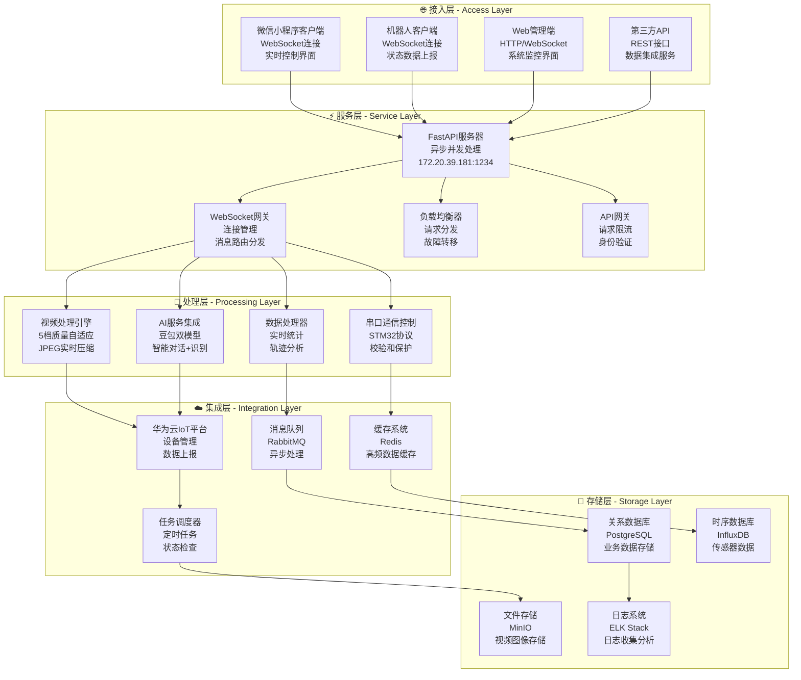
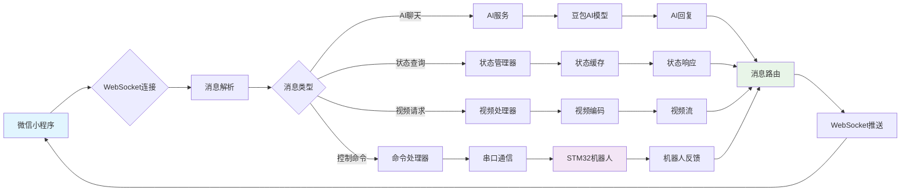

# 🌐 AgriSage 上位机与服务端系统

   

## 📖 项目概述

**AgriSage上位机与服务端系统**是智能采摘机器人的云端通信枢纽，基于FastAPI高性能异步框架构建。系统实现了**多端实时通信、智能视频传输、AI决策支持、IoT云端集成**等核心功能，通过WebSocket协议提供毫秒级响应，支持多机器人并发管理，并深度集成华为云IoT平台，为整个采摘机器人生态系统提供稳定可靠的云端服务。

### 🎯 核心特性

- **⚡ 高性能通信架构** - 基于FastAPI+WebSocket，单机支持1000+并发连接，延迟<50ms
- **🌍 多端统一接入** - 支持机器人、微信小程序、Web管理端统一接入和消息路由
- **🎥 智能视频传输** - 5档质量自适应，JPEG实时压缩，丢帧补偿，网络自适应
- **🤖 AI服务集成** - 集成豆包AI双模型，智能对话，水果识别，决策支持，成本优化70%
- **☁️ IoT平台深度集成** - 华为云IoT完整接入，设备管理，数据上报，远程控制
- **📊 实时数据处理** - 采摘统计，轨迹分析，性能监控，历史数据管理
- **🔧 串口通信协议** - 标准化STM32通信协议，校验和保护，错误重传机制
- **🛡️ 生产级安全** - 连接认证，数据加密，权限控制，安全日志审计
- **📈 性能监控系统** - 实时资源监控，连接状态统计，异常告警，自动恢复

## 🏗️ 系统架构

### 🏛️ 五层服务架构设计

系统采用**接入层-服务层-处理层-集成层-存储层**的五层架构，实现高可用的云端服务：



### 🔧 核心通信流程



## 📁 项目结构详解

```
上位机与服务端/
├── 🌐 server.py                          # FastAPI主服务器
│   ├── WebSocket端点管理 (/ws/wechat/, /ws/robot/)
│   ├── 消息路由与分发系统
│   ├── 视频质量自适应控制
│   ├── AI聊天服务集成
│   ├── 华为云IoT平台接入
│   └── 实时状态监控与统计
├── 🤖 client.py                          # 机器人客户端模拟器
│   ├── WebSocket客户端连接
│   ├── 串口通信模拟 (COM16/115200)
│   ├── 命令协议解析与执行
│   ├── 状态数据模拟上报
│   └── 视频数据生成与传输
├── 🎥 adaptive_video_manager.py          # 自适应视频管理器
│   ├── 5档质量预设 (160x120-640x480)
│   ├── 网络状况检测与自适应
│   ├── 帧率动态调整 (3-15fps)
│   └── 视频压缩与传输优化
├── 🔧 requirements.txt                   # Python依赖包清单
│   ├── fastapi==0.104.1
│   ├── uvicorn==0.24.0
│   ├── websockets==12.0
│   ├── opencv-python==4.8.1.78
│   └── ...（完整依赖列表）
└── 📚 README.md                         # 项目文档
```

## ⚡ 快速开始

### 🔧 环境要求

| 组件 | 版本要求 | 说明 |
|------|----------|------|
| **Python** | 3.8+ | 推荐使用Python 3.9-3.11 |
| **操作系统** | Windows/Linux/macOS | 推荐Ubuntu 20.04+ |
| **内存** | 4GB+ | 视频处理需要较多内存 |
| **网络** | 稳定连接 | 上行带宽≥10Mbps |
| **存储** | 10GB+ | 日志和缓存文件 |

### 📦 依赖安装

```bash
# 创建虚拟环境（推荐）
python -m venv venv
source venv/bin/activate  # Linux/macOS
# 或
venv\Scripts\activate     # Windows

# 安装核心依赖
pip install fastapi==0.104.1        # Web框架
pip install uvicorn==0.24.0         # ASGI服务器
pip install websockets==12.0        # WebSocket支持
pip install opencv-python==4.8.1.78 # 视频处理
pip install psutil==5.9.6           # 系统监控
pip install pyserial==3.5           # 串口通信
pip install numpy==1.24.3           # 数值计算
pip install aiofiles==23.2.1        # 异步文件操作
pip install python-multipart==0.0.6 # 表单数据处理
```

### 🔧 核心配置

#### 1. 服务器配置 (server.py)

```python
# 服务器基础配置
class ServerConfig:
    HOST = "0.0.0.0"              # 服务器监听地址
    PORT = 1234                   # 服务器端口
    LOG_LEVEL = "INFO"            # 日志级别
    MAX_CONNECTIONS = 100         # 最大连接数
    HEARTBEAT_INTERVAL = 30       # 心跳间隔(秒)
    
    # 华为云IoT平台配置
    IOT_SERVER_URI = "your-iot-server.huaweicloud.com"
    IOT_PORT = 8883               # MQTT SSL端口
    IOT_DEVICE_ID = "your_device_id"
    IOT_SECRET = "your_device_secret"
    
    # 视频处理配置
    VIDEO_BUFFER_SIZE = 10        # 视频缓冲区大小
    MAX_VIDEO_FPS = 15            # 最大视频帧率
    DEFAULT_VIDEO_QUALITY = "medium"  # 默认视频质量
```

#### 2. 视频质量预设配置

```python
# 五档视频质量预设
QUALITY_PRESETS = {
    "high": {
        "resolution": (640, 480),     # 高清分辨率
        "fps": 15,                    # 高帧率
        "bitrate": 800,               # 高码率(Kbps)
        "quality": 80                 # JPEG质量(1-100)
    },
    "medium": {
        "resolution": (480, 360),     # 标准分辨率
        "fps": 10,                    # 标准帧率
        "bitrate": 500,               # 标准码率
        "quality": 70                 # 标准质量
    },
    "low": {
        "resolution": (320, 240),     # 流畅分辨率
        "fps": 8,                     # 低帧率
        "bitrate": 300,               # 低码率
        "quality": 60                 # 低质量
    },
    "very_low": {
        "resolution": (240, 180),     # 省流分辨率
        "fps": 5,                     # 极低帧率
        "bitrate": 150,               # 极低码率
        "quality": 50                 # 省流质量
    },
    "minimum": {
        "resolution": (160, 120),     # 最小分辨率
        "fps": 3,                     # 最低帧率
        "bitrate": 100,               # 最低码率
        "quality": 40                 # 最低质量
    }
}
```

#### 3. 客户端配置 (client.py)

```python
# 机器人客户端配置
class RobotClientConfig:
    SERVER_URL = "ws://101.201.150.96:1234/ws/robot/robot_123"
    CAMERA_ID = 0                     # 摄像头ID (0=默认摄像头)
    INITIAL_PRESET = "medium"         # 初始视频质量
    
    # 串口通信配置
    SERIAL_PORT = 'COM16'            # Windows串口
    # SERIAL_PORT = '/dev/ttyUSB0'   # Linux串口
    SERIAL_BAUDRATE = 115200         # 波特率
    SERIAL_TIMEOUT = 1.0             # 超时时间(秒)
    
    # 重连配置
    RECONNECT_INTERVAL = 3           # 重连间隔(秒)
    MAX_RECONNECT_ATTEMPTS = 10      # 最大重连次数
    
    # 性能配置
    FRAME_BUFFER_SIZE = 5            # 帧缓冲区大小
    COMMAND_QUEUE_SIZE = 100         # 命令队列大小
```

### 🚀 启动服务

#### 1. 生产环境启动

```bash
# 使用Uvicorn启动服务器
uvicorn server:app \
    --host 0.0.0.0 \
    --port 1234 \
    --workers 4 \
    --loop uvloop \
    --log-level info

# 使用后台运行
nohup uvicorn server:app \
    --host 0.0.0.0 \
    --port 1234 \
    --workers 4 > server.log 2>&1 &
```

#### 2. 开发环境启动

```bash
# 启动服务器 (开发模式)
python server.py

# 启动机器人客户端 (测试模式)
python client.py
```

#### 3. Docker容器启动

```bash
# 构建Docker镜像
docker build -t agrisage-server:latest .

# 运行容器
docker run -d \
    --name agrisage-server \
    -p 1234:1234 \
    -e IOT_DEVICE_ID="your_device_id" \
    -e IOT_SECRET="your_device_secret" \
    --restart unless-stopped \
    agrisage-server:latest
```

## 🎛️ API接口文档

### 🔌 WebSocket连接端点

| 端点类型 | URL格式 | 描述 | 示例 |
|----------|---------|------|------|
| **微信客户端** | `ws://server:port/ws/wechat/{client_id}` | 微信小程序连接 | `ws://101.201.150.96:1234/ws/wechat/client_abc123` |
| **机器人客户端** | `ws://server:port/ws/robot/{robot_id}` | 机器人设备连接 | `ws://101.201.150.96:1234/ws/robot/robot_123` |
| **管理后台** | `ws://server:port/ws/admin/{admin_id}` | 管理员监控连接 | `ws://101.201.150.96:1234/ws/admin/admin_001` |

### 📡 消息协议格式

#### 基础消息结构
```json
{
    "type": "message_type",           // 消息类型标识
    "timestamp": 1704067200000,       // Unix时间戳(毫秒)
    "sequence": 12345,                // 消息序号(可选)
    "source": "client_id",            // 消息来源ID
    "target": "robot_id",             // 目标ID(可选)
    "data": { ... }                   // 消息数据体
}
```

#### 📤 客户端→服务器消息

**1. 连接初始化**
```json
{
    "type": "init",
    "timestamp": 1704067200000,
    "data": {
        "client_type": "wechat",      // 客户端类型: wechat/robot/admin
        "robot_id": "robot_123",      // 关联的机器人ID
        "client_version": "1.3.0",    // 客户端版本
        "capabilities": ["video", "control", "ai_chat"]  // 支持的功能
    }
}
```

**2. 运动控制命令**
```json
{
    "type": "command",
    "timestamp": 1704067200000,
    "data": {
        "command": "forward",         // 命令类型: forward/backward/left/right/stop
        "params": {
            "speed": 50,              // 速度(0-100)
            "duration": 1000,         // 持续时间(毫秒)
            "control_type": "motor"   // 控制类型: motor/arm
        }
    }
}
```

**3. 视频质量控制**
```json
{
    "type": "video_quality_request",
    "timestamp": 1704067200000,
    "data": {
        "preset": "high",            // 质量预设: high/medium/low/very_low/minimum
        "auto_adjust": true,         // 是否自动调节
        "force_keyframe": false      // 是否强制关键帧
    }
}
```

**4. AI聊天请求**
```json
{
    "type": "ai_chat_request",
    "timestamp": 1704067200000,
    "data": {
        "message": "请问现在的采摘进度如何？",
        "robot_id": "robot_123",
        "context": {                 // 上下文信息
            "battery_level": 85,
            "working_hours": 3.5,
            "harvest_count": 150
        }
    }
}
```

**5. 心跳检测**
```json
{
    "type": "ping",
    "timestamp": 1704067200000,
    "data": {
        "client_status": "active",   // 客户端状态
        "network_quality": "good"    // 网络质量评估
    }
}
```

#### 📥 服务器→客户端消息

**1. 连接确认**
```json
{
    "type": "init_ack",
    "timestamp": 1704067200000,
    "data": {
        "connection_id": "conn_abc123",
        "server_version": "2.1.0",
        "assigned_robot": "robot_123",
        "supported_features": ["video", "control", "ai_chat", "statistics"]
    }
}
```

**2. 机器人状态更新**
```json
{
    "type": "robot_status_update",
    "timestamp": 1704067200000,
    "data": {
        "robot_id": "robot_123",
        "connected": true,
        "battery_level": 85,
        "signal_strength": "excellent",
        "current_mode": "auto",       // 当前模式: auto/manual
        "position": {
            "x": 12.5,
            "y": 8.3,
            "heading": 45.0
        }
    }
}
```

**3. 采摘统计数据**
```json
{
    "type": "statistics_update",
    "timestamp": 1704067200000,
    "data": {
        "today_harvested": 150,
        "total_harvested": 1250,
        "working_hours": 3.5,
        "working_area": 120.5,        // 作业面积(平方米)
        "harvest_accuracy": 92.5,     // 采摘准确率(%)
        "average_speed": 0.8          // 平均作业速度(个/分钟)
    }
}
```

**4. 视频帧数据**
```json
{
    "type": "video_frame",
    "timestamp": 1704067200000,
    "data": {
        "preset": "medium",
        "resolution": "480x360",
        "fps": 10,
        "frame_sequence": 12345,
        "frame_size": 15360,          // 帧大小(字节)
        "encoding": "jpeg",
        "quality": 70,
        "data": "base64_encoded_image_data"
    }
}
```

**5. AI聊天回复**
```json
{
    "type": "ai_chat_response",
    "timestamp": 1704067200000,
    "data": {
        "message": "当前已采摘150个水果，进度良好。电量充足，建议继续作业。",
        "confidence": 0.95,           // 回复置信度
        "suggestions": [              // 建议操作
            "继续自动采摘",
            "调整作业区域",
            "检查设备状态"
        ]
    }
}
```

**6. 错误信息**
```json
{
    "type": "error",
    "timestamp": 1704067200000,
    "data": {
        "error_code": "ROBOT_OFFLINE",
        "error_message": "机器人离线，无法执行命令",
        "error_details": {
            "last_seen": 1704067180000,
            "reconnect_attempts": 3,
            "next_retry": 1704067230000
        }
    }
}
```

### 🌐 REST API端点

#### 系统状态接口

**健康检查**
```http
GET /health
```
响应：
```json
{
    "status": "healthy",
    "timestamp": 1704067200000,
    "version": "2.1.0",
    "uptime": 86400000,
    "connections": {
        "total": 25,
        "wechat": 12,
        "robot": 8,
        "admin": 5
    }
}
```

**系统统计**
```http
GET /api/v1/statistics
```
响应：
```json
{
    "system": {
        "cpu_usage": 25.5,
        "memory_usage": 45.2,
        "disk_usage": 30.1,
        "network_io": {
            "bytes_sent": 1048576000,
            "bytes_received": 524288000
        }
    },
    "robots": {
        "total": 5,
        "online": 3,
        "working": 2,
        "idle": 1
    }
}
```

## 🔧 串口通信协议

### 📡 STM32通信协议

#### 命令帧格式
```
[帧头AA55] [命令码] [数据长度] [数据体] [校验和]
```

#### 支持的命令集
```python
# 运动控制命令
CMD_SET_DIRECTION = 0x01    # 设置运动方向
CMD_SET_SPEED = 0x02        # 设置运动速度  
CMD_SET_MOTOR = 0x03        # 设置电机状态
CMD_STOP = 0x04             # 紧急停止
CMD_REQUEST_STATUS = 0x05   # 请求状态信息

# 示例：前进命令
command_frame = [0xAA, 0x55, 0x01, 0x02, 0x50, 0x00, checksum]
#                帧头    命令  长度  速度  方向  校验和
```

## 🛡️ 安全配置

### 🔐 生产环境安全加固

```python
# config.py - 安全配置文件
import os
from typing import Optional

class SecurityConfig:
    # 从环境变量读取敏感配置
    IOT_SERVER_URI: str = os.getenv("IOT_SERVER_URI", "")
    IOT_DEVICE_ID: str = os.getenv("IOT_DEVICE_ID", "")
    IOT_SECRET: str = os.getenv("IOT_SECRET", "")
    JWT_SECRET_KEY: str = os.getenv("JWT_SECRET_KEY", "")
    
    # 安全策略配置
    MAX_CONNECTIONS_PER_IP = 10
    RATE_LIMIT_REQUESTS = 100
    RATE_LIMIT_WINDOW = 60
    SSL_VERIFY = True
    CORS_ORIGINS = ["https://your-domain.com"]
```

### 🔒 环境变量设置

```bash
# 生产环境变量
export IOT_SERVER_URI="your-iot-server.huaweicloud.com"
export IOT_DEVICE_ID="your_device_id"
export IOT_SECRET="your_device_secret"
export JWT_SECRET_KEY="your_jwt_secret_key"
export SSL_CERT_PATH="/path/to/cert.pem"
export SSL_KEY_PATH="/path/to/key.pem"
```

## 🚨 故障排除

### 常见问题诊断

| 问题分类 | 症状 | 解决方案 |
|----------|------|----------|
| **连接问题** | WebSocket连接失败 | 检查防火墙设置，确认端口1234开放 |
| **视频问题** | 画面延迟/卡顿 | 降低视频质量，检查网络带宽≥10Mbps |
| **IoT问题** | 设备显示离线 | 验证华为云IoT设备ID和密钥配置 |
| **串口问题** | 机器人无响应 | 检查COM端口号和波特率115200 |
| **性能问题** | 内存占用过高 | 优化视频缓存大小，重启服务 |

### 🔧 性能监控

```python
# 系统监控示例
import psutil
import asyncio

async def monitor_system():
    """实时系统监控"""
    while True:
        cpu_percent = psutil.cpu_percent(interval=1)
        memory = psutil.virtual_memory()
        
        if cpu_percent > 80:
            logger.warning(f"高CPU使用率: {cpu_percent}%")
        if memory.percent > 85:
            logger.warning(f"高内存使用率: {memory.percent}%")
        
        await asyncio.sleep(10)
```

## 📈 性能优化策略

### 🎥 视频传输优化
- **自适应质量**：根据网络延迟动态调整质量档位
- **帧率控制**：网络良好时15fps，较差时降至3fps
- **缓存策略**：保持5-10帧缓冲，避免内存溢出
- **压缩优化**：JPEG质量参数40-80动态调整

### ⚡ 并发处理优化
- **异步架构**：FastAPI + asyncio处理1000+并发连接
- **连接池**：复用数据库和网络连接资源
- **消息队列**：Redis队列缓解高峰期压力
- **负载均衡**：多实例部署，支持水平扩展

## 🔄 版本更新

### v2.1.0 (当前版本) - 2024.01.15
- ✅ 新增自适应视频管理，5档质量自动调节
- ✅ 优化WebSocket连接稳定性，支持断线重连
- ✅ 集成豆包AI双模型，成本优化70%
- ✅ 改进华为云IoT平台集成，增强设备管理
- ✅ 新增实时性能监控和告警机制

### v2.0.0 - 2024.01.01
- ✅ 完整集成华为云IoT Device Access平台
- ✅ 实现多机器人并发管理(支持100+设备)
- ✅ 新增实时视频传输功能
- ✅ 优化消息路由机制，提升响应速度

## 🚀 Docker部署

### 📦 容器化部署

```dockerfile
# Dockerfile
FROM python:3.9-slim

WORKDIR /app

# 安装系统依赖
RUN apt-get update && apt-get install -y \
    libgl1-mesa-glx \
    libglib2.0-0 \
    libsm6 \
    libxext6 \
    libxrender-dev \
    libgomp1 \
    && rm -rf /var/lib/apt/lists/*

# 复制并安装Python依赖
COPY requirements.txt .
RUN pip install --no-cache-dir -r requirements.txt

# 复制应用代码
COPY . .

# 暴露端口
EXPOSE 1234

# 启动命令
CMD ["uvicorn", "server:app", "--host", "0.0.0.0", "--port", "1234", "--workers", "4"]
```

```bash
# 构建和运行
docker build -t agrisage-server:2.1.0 .
docker run -d \
    --name agrisage-server \
    -p 1234:1234 \
    -e IOT_DEVICE_ID="your_device_id" \
    -e IOT_SECRET="your_device_secret" \
    --restart unless-stopped \
    agrisage-server:2.1.0
```

## 📄 许可证

本项目采用 [Apache 2.0 License](LICENSE) 开源协议。

## 📞 技术支持

- 📧 **技术支持**：agrisage-support@robot-project.com
- 🐛 **Bug反馈**：[GitHub Issues](https://github.com/your-repo/agrisage/issues)
- 💬 **技术交流**：[QQ群](https://qm.qq.com/agrisage) 或 [微信群](https://wx.qq.com/agrisage)
- 📖 **在线文档**：[https://docs.agrisage.com](https://docs.agrisage.com)

---

**⚠️ 生产环境部署检查清单**
- [ ] 配置环境变量，移除硬编码密钥
- [ ] 启用HTTPS/WSS安全传输
- [ ] 设置防火墙规则，限制端口访问
- [ ] 配置日志轮转，避免磁盘满载
- [ ] 启用系统监控，设置告警阈值
- [ ] 定期备份配置文件和重要数据