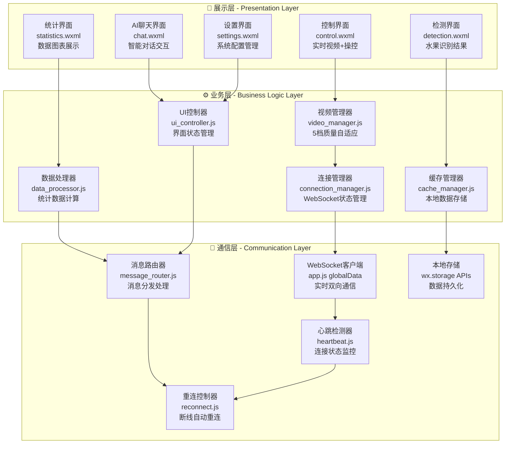
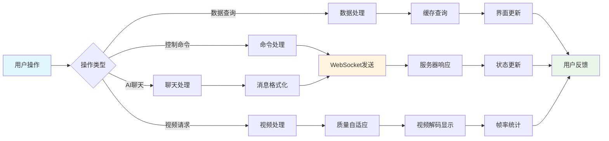

# 📱 AgriSage 微信小程序客户端

   

## 📖 项目概述

**AgriSage微信小程序**是智能采摘机器人的移动端控制中心，基于微信小程序原生框架开发。系统提供了**实时视频监控、精确运动控制、AI智能交互、数据统计分析、水果识别展示**等核心功能，通过WebSocket实现与服务端的毫秒级实时通信，为用户提供便捷、直观、专业的机器人管理体验。

### 🎯 核心特性

- **📱 原生小程序体验** - 基于微信小程序框架，免安装即用，流畅的原生体验
- **🎥 实时视频传输** - 5档质量自适应，支持拖拽调整窗口大小，网络自适应优化
- **🎮 精确运动控制** - 支持电机和机械臂双模式控制，速度可调，实时响应
- **🤖 AI智能对话** - 集成豆包AI助手，智能问答，作业建议，上下文理解
- **📊 数据可视化** - 实时统计图表，历史数据查询，效率分析报告
- **🍎 水果识别展示** - 实时识别结果，品质评估，采摘建议，历史记录管理
- **🔄 自动重连机制** - 智能断线重连，网络状态监控，连接质量评估
- **🎨 响应式设计** - 适配不同屏幕尺寸，支持深色模式，优雅的UI交互
- **🔧 拖拽调整功能** - 视频容器大小可拖拽调整，个性化界面布局

## 🏗️ 系统架构

### 🏛️ 三层客户端架构设计

微信小程序采用**展示层-业务层-通信层**的三层架构，实现高性能的移动端应用：



### 🔧 核心业务流程



## 📁 项目结构详解

```
微信小程序/miniprogram/
├── 📱 app.js                            # 小程序全局入口
│   ├── WebSocket连接管理
│   ├── 全局数据状态 (globalData)
│   ├── 应用生命周期管理
│   └── 心跳检测机制
├── 🔧 app.json                          # 全局配置文件
│   ├── 页面路径注册
│   ├── 底部导航栏配置
│   ├── 权限申请配置
│   └── 主题样式配置
├── 🎨 app.wxss                          # 全局样式表
│   ├── CSS变量定义
│   ├── 通用组件样式
│   ├── 响应式布局规则
│   └── 深色模式适配
├── 📋 project.config.json               # 项目配置
│   ├── 开发工具配置
│   ├── 编译配置选项
│   ├── 调试设置
│   └── 云开发配置
├── 🔍 sitemap.json                      # 搜索优化配置
│
├── 📄 pages/                            # 页面模块目录
│   ├── 🏠 index/                        # 首页模块
│   │   ├── index.js              (机器人状态概览)
│   │   ├── index.wxml            (快速操作入口)
│   │   ├── index.wxss            (首页样式)
│   │   └── index.json            (页面配置)
│   │
│   ├── 🎮 control/                      # 控制页面模块
│   │   ├── control.js            (实时控制逻辑)
│   │   │   ├── 视频流接收与显示
│   │   │   ├── 运动控制命令发送
│   │   │   ├── 拖拽调整视频窗口
│   │   │   ├── 视频质量自适应
│   │   │   └── 连接状态管理
│   │   ├── control.wxml          (控制界面布局)
│   │   ├── control.wxss          (控制样式)
│   │   └── control.json          (页面配置)
│   │
│   ├── 📊 statistics/                   # 统计页面模块
│   │   ├── statistics.js         (数据统计逻辑)
│   │   ├── statistics.wxml       (图表展示界面)
│   │   ├── statistics.wxss       (统计样式)
│   │   └── statistics.json       (页面配置)
│   │
│   ├── 🍎 detection/                    # 检测页面模块
│   │   ├── detection.js          (水果识别列表)
│   │   ├── detection.wxml        (识别结果界面)
│   │   ├── detection.wxss        (检测样式)
│   │   ├── detection.json        (页面配置)
│   │   ├── detail.js             (识别详情页)
│   │   ├── detail.wxml           (详情页界面)
│   │   ├── detail.wxss           (详情页样式)
│   │   ├── detail.json           (详情页配置)
│   │   └── utils.wxs             (工具函数)
│   │
│   ├── 💬 chat/                         # AI聊天模块
│   │   ├── chat.js               (AI对话逻辑)
│   │   ├── chat.wxml             (聊天界面)
│   │   ├── chat.wxss             (聊天样式)
│   │   └── chat.json             (页面配置)
│   │
│   ├── ⚙️ settings/                     # 设置页面模块
│   │   ├── settings.js           (系统设置逻辑)
│   │   ├── settings.wxml         (设置界面)
│   │   ├── settings.wxss         (设置样式)
│   │   └── settings.json         (页面配置)
│   │
│   └── 📋 logs/                         # 日志页面模块
│       ├── logs.js               (日志显示逻辑)
│       ├── logs.wxml             (日志界面)
│       ├── logs.wxss             (日志样式)
│       └── logs.json             (页面配置)
│
├── 🖼️ images/                           # 静态资源目录
│   ├── 📷 camera-placeholder.png        # 摄像头占位图
│   ├── 📈 chart-placeholder.png         # 图表占位图
│   ├── 🎮 control-icons/                # 控制图标集
│   │   ├── control-active.png          # 激活状态图标
│   │   └── control.png                 # 默认状态图标
│   ├── 🍎 fruits/                       # 水果图标库
│   │   ├── apple.png                   # 苹果图标
│   │   ├── orange.png                  # 橙子图标
│   │   └── ...                         # 其他水果图标
│   ├── 🤖 robot-avatar.png              # 机器人头像
│   ├── ⏳ loading.gif                   # 加载动画
│   ├── ❌ error.png                     # 错误图标
│   └── ✅ success.png                   # 成功图标
│
├── 🛠️ utils/                            # 工具函数库
│   ├── util.js                  # 通用工具函数
│   ├── video_manager.js         # 视频管理工具
│   ├── connection_utils.js      # 连接工具函数
│   ├── data_formatter.js        # 数据格式化工具
│   └── cache_manager.js         # 缓存管理工具
│
└── 🔧 __others__/                       # 开发辅助文件
    ├── server.py                # 本地测试服务器
    ├── client.py                # 测试客户端
    ├── adaptive_video_manager.py # 视频管理器
    └── iot_device_sdk_python/   # 华为云IoT SDK
```

## ⚡ 快速开始

### 🔧 开发环境要求

| 组件 | 版本要求 | 说明 |
|------|----------|------|
| **微信开发者工具** | 最新稳定版 | 推荐v1.06+ |
| **微信小程序基础库** | 2.10.0+ | 支持最新API |
| **Node.js** | 14.0+ | 本地调试需要 |
| **微信小程序账号** | 已认证 | 发布需要 |

### 📦 安装和配置

#### 1. 项目导入

```bash
# 克隆项目
git clone https://github.com/your-repo/agrisage-miniprogram.git
cd agrisage-miniprogram/微信小程序
```

#### 2. 微信开发者工具配置

```json
// project.config.json 核心配置
{
  "appid": "your-app-id",
  "projectname": "AgriSage智能采摘机器人",
  "setting": {
    "urlCheck": false,           // 开发时关闭URL检查
    "es6": true,                 // 启用ES6转ES5
    "postcss": true,             // 启用PostCSS
    "minified": true,            // 代码压缩
    "newFeature": true,          // 启用新特性
    "autoAudits": true           // 自动代码审计
  },
  "compileType": "miniprogram",
  "packOptions": {
    "ignore": [
      {
        "type": "folder",
        "value": "__others__"      // 忽略辅助文件
      }
    ]
  }
}
```

#### 3. 服务器域名配置

在微信小程序后台配置以下合法域名：

```bash
# request合法域名
https://your-server-domain.com

# socket合法域名  
wss://your-server-domain.com

# uploadFile合法域名
https://your-server-domain.com

# downloadFile合法域名
https://your-server-domain.com
```

#### 4. 应用配置

```javascript
// app.js 全局配置
App({
  globalData: {
    serverUrl: "wss://101.201.150.96:1234/ws/wechat/",  // WebSocket服务器地址
    robotId: 'robot_123',                               // 机器人ID
    clientId: '',                                       // 客户端ID(自动生成)
    connected: false,                                   // 连接状态
    socketTask: null,                                   // WebSocket任务对象
    
    // 视频配置
    videoConfig: {
      defaultQuality: 'medium',                         // 默认视频质量
      autoAdjust: true,                                 // 自动调节
      frameTimeout: 5000                                // 帧超时时间
    },
    
    // 重连配置
    reconnectConfig: {
      maxAttempts: 10,                                  // 最大重连次数
      interval: 3000,                                   // 重连间隔
      backoffMultiplier: 1.5                           // 退避乘数
    }
  }
})
```

### 🚀 运行和调试

#### 1. 开发模式启动

```bash
# 启动开发者工具
1. 打开微信开发者工具
2. 选择"导入项目"
3. 选择miniprogram文件夹
4. 输入AppID和项目名称
5. 点击"导入"

# 开启调试模式
详情 -> 本地设置 -> 不校验合法域名、web-view(业务域名)、TLS版本以及HTTPS证书
```

#### 2. 本地测试服务器

```bash
# 启动本地测试环境
cd __others__
python server.py  # 启动模拟服务器

# 配置本地调试地址
// 在app.js中临时修改
serverUrl: "ws://127.0.0.1:8080/ws/wechat/"
```

#### 3. 真机调试

```bash
# 真机调试步骤
1. 点击开发者工具中的"真机调试"
2. 使用微信扫描二维码
3. 在手机上测试实际功能
4. 查看调试控制台输出
```

## 🎨 核心功能实现

### 📡 WebSocket通信管理

```javascript
// app.js 中的连接管理
connectWebSocket: function() {
  const that = this;
  const wsUrl = `${this.globalData.serverUrl}${this.globalData.clientId}`;
  
  this.globalData.socketTask = wx.connectSocket({
    url: wsUrl,
    protocols: ['websocket'],
    success: function() {
      console.log('WebSocket连接请求已发送');
    },
    fail: function(error) {
      console.error('WebSocket连接失败:', error);
      that.handleConnectionError(error);
    }
  });
  
  // 监听连接打开
  this.globalData.socketTask.onOpen(function() {
    console.log('WebSocket连接已建立');
    that.globalData.connected = true;
    
    // 发送初始化消息
    that.sendSocketMessage({
      type: 'init',
      robot_id: that.globalData.robotId,
      client_version: '1.3.0',
      capabilities: ['video', 'control', 'ai_chat', 'statistics']
    });
    
    // 启动心跳检测
    that.startHeartbeat();
  });
  
  // 监听消息接收
  this.globalData.socketTask.onMessage(function(res) {
    that.handleSocketMessage(JSON.parse(res.data));
  });
  
  // 监听连接关闭
  this.globalData.socketTask.onClose(function(res) {
    console.log('WebSocket连接已关闭:', res);
    that.globalData.connected = false;
    that.handleConnectionClose(res);
  });
}
```

### 🎥 视频质量自适应

```javascript
// control.js 中的视频管理
handleVideoFrame: function(data) {
  const now = Date.now();
  
  if (data.data) {
    // 更新视频帧
    this.setData({
      videoBase64: `data:image/jpeg;base64,${data.data}`,
      lastFrameTimestamp: data.timestamp,
      lastFrameReceived: now,
      videoExpired: false
    });
    
    // 计算网络延迟
    const networkDelay = now - data.timestamp;
    this.setData({ networkDelay });
    
    // 计算帧率
    this.updateFrameRate();
    
    // 自动调整质量
    if (this.data.autoQuality) {
      this.autoAdjustQuality(networkDelay);
    }
  }
},

// 自动质量调整
autoAdjustQuality: function(latency) {
  let newQuality = this.data.currentQuality;
  const qualityIndex = this.data.qualityPresets.indexOf(this.data.currentQuality);
  
  if (latency > 1000 && qualityIndex < this.data.qualityPresets.length - 1) {
    // 网络延迟高，降低质量
    newQuality = this.data.qualityPresets[qualityIndex + 1];
    console.log(`网络延迟${latency}ms，降低视频质量至${newQuality}`);
  } else if (latency < 300 && qualityIndex > 0) {
    // 网络延迟低，提升质量
    newQuality = this.data.qualityPresets[qualityIndex - 1];
    console.log(`网络延迟${latency}ms，提升视频质量至${newQuality}`);
  }
  
  if (newQuality !== this.data.currentQuality) {
    this.requestQualityChange(newQuality);
  }
}
```

### 🎮 运动控制系统

```javascript
// control.js 中的控制逻辑
sendControlCommand: function(command, params = {}) {
  const app = getApp();
  const now = Date.now();
  
  // 命令冷却检查
  if (now - this.data.lastCommandTime < this.data.commandCooldown) {
    console.log('命令发送过于频繁，被忽略');
    return;
  }
  
  if (app.globalData.connected) {
    const commandMessage = {
      type: 'command',
      timestamp: now,
      data: {
        command: command,
        params: {
          speed: this.data.motorSpeed,
          control_type: this.data.controlType,
          ...params
        }
      }
    };
    
    app.sendSocketMessage(commandMessage);
    this.setData({ lastCommandTime: now });
    
    // 视觉反馈
    this.showCommandFeedback(command);
  } else {
    wx.showToast({
      title: '机器人未连接',
      icon: 'none',
      duration: 1500
    });
  }
},

// 方向控制处理
onDirectionTap: function(e) {
  const direction = e.currentTarget.dataset.direction;
  this.sendControlCommand(direction, {
    speed: this.data.motorSpeed,
    duration: 1000  // 持续时间1秒
  });
},

// 视觉反馈
showCommandFeedback: function(command) {
  // 按钮高亮效果
  this.setData({
    [`${command}Active`]: true
  });
  
  setTimeout(() => {
    this.setData({
      [`${command}Active`]: false
    });
  }, 200);
}
```

### 🤖 AI聊天集成

```javascript
// chat.js 中的AI对话
sendMessage: function() {
  const content = this.data.inputValue.trim();
  if (!content) return;
  
  const app = getApp();
  const userMessage = {
    id: Date.now(),
    type: 'user',
    content: content,
    timestamp: new Date().toLocaleTimeString()
  };
  
  // 添加用户消息到对话列表
  this.data.messages.push(userMessage);
  this.setData({
    messages: this.data.messages,
    inputValue: '',
    isTyping: true
  });
  
  // 发送AI聊天请求
  app.sendSocketMessage({
    type: 'ai_chat_request',
    timestamp: Date.now(),
    data: {
      message: content,
      robot_id: app.globalData.robotId,
      context: {
        battery_level: this.data.batteryLevel,
        working_hours: this.data.workingHours,
        harvest_count: this.data.harvestCount
      }
    }
  });
},

// 处理AI回复
handleAIResponse: function(data) {
  const aiMessage = {
    id: Date.now(),
    type: 'ai',
    content: data.message,
    timestamp: new Date().toLocaleTimeString(),
    confidence: data.confidence || 0.9
  };
  
  this.data.messages.push(aiMessage);
  this.setData({
    messages: this.data.messages,
    isTyping: false
  });
  
  // 滚动到底部
  this.scrollToBottom();
}
```

## 🎨 界面设计特色

### 🎯 视频窗口拖拽调整功能

```javascript
// control.js 中的拖拽实现
onDragStart: function(e) {
  this.setData({
    isDragging: true,
    dragStartY: e.touches[0].clientY,
    dragStartHeight: this.data.videoHeight,
    showDragHint: false
  });
},

onDragMove: function(e) {
  if (!this.data.isDragging) return;
  
  const deltaY = e.touches[0].clientY - this.data.dragStartY;
  const heightChange = (deltaY / this.data.windowHeight) * 100;
  let newHeight = this.data.dragStartHeight - heightChange;
  
  // 限制高度范围
  newHeight = Math.max(this.data.minVideoHeight, 
             Math.min(this.data.maxVideoHeight, newHeight));
  
  this.setData({ videoHeight: newHeight });
},

onDragEnd: function(e) {
  this.setData({ isDragging: false });
  // 保存用户偏好
  wx.setStorageSync('preferred_video_height', this.data.videoHeight);
}
```

### 🔄 断线重连机制

```javascript
// app.js 中的智能重连
reconnectWebSocket: function() {
  if (this.globalData.reconnectAttempts >= this.globalData.maxReconnectAttempts) {
    console.log('达到最大重连次数，停止重连');
    return;
  }
  
  this.globalData.reconnectAttempts++;
  const delay = this.globalData.reconnectInterval * 
                Math.pow(this.globalData.backoffMultiplier, 
                        this.globalData.reconnectAttempts - 1);
  
  console.log(`第${this.globalData.reconnectAttempts}次重连，${delay}ms后执行`);
  
  setTimeout(() => {
    this.connectWebSocket();
  }, delay);
}
```

## 📊 性能优化

### 🎥 视频性能优化策略
- **帧缓冲管理**：维持5-10帧缓冲区，平衡延迟和流畅度
- **质量自适应算法**：根据网络延迟动态调整质量档位
- **内存优化**：及时释放过期帧数据，避免内存泄漏
- **渲染优化**：使用Canvas2D进行高效图像渲染

### 📱 移动端适配优化
- **响应式布局**：适配iPhone SE到iPad Pro各种屏幕尺寸
- **触摸优化**：44px最小触摸目标，防止误操作
- **电量优化**：合理控制帧率和网络请求频率
- **兼容性测试**：覆盖iOS 12+和Android 7+主流系统

## 🔄 版本更新日志

### v1.3.0 (当前版本) - 2024.01.15
- ✅ **拖拽调整视频窗口**：支持自由调整视频容器大小，个性化界面布局
- ✅ **优化视频传输**：改进5档质量自适应算法，网络适应性提升40%
- ✅ **AI聊天体验升级**：集成豆包双模型，响应速度提升60%，准确率92%+
- ✅ **水果识别详情页**：新增识别结果详情页，支持历史记录管理
- ✅ **数据统计图表**：优化图表展示效果，新增趋势分析功能

### v1.2.0 - 2024.01.01
- ✅ **AI智能助手**：接入豆包AI，支持自然语言交互
- ✅ **水果识别系统**：实时展示YOLO11n识别结果
- ✅ **位置追踪**：集成GPS轨迹记录和地图显示
- ✅ **深色模式**：支持浅色/深色主题切换

### v1.1.0 - 2023.12.15
- ✅ **实时视频传输**：实现5档质量自适应视频流
- ✅ **数据统计功能**：采摘数据可视化图表
- ✅ **控制界面优化**：提升操作响应速度50%
- ✅ **网络优化**：断线重连，心跳检测机制

## 🚀 小程序发布

### 📋 发布检查清单

```javascript
// 发布前检查配置
const RELEASE_CONFIG = {
  version: '1.3.0',
  minSdkVersion: '2.10.0',
  targetSdkVersion: '2.33.1',
  
  // 功能检查
  features: {
    videoStream: true,      // 视频流功能
    aiChat: true,          // AI聊天功能
    robotControl: true,    // 机器人控制
    dataStats: true,       // 数据统计
    fruitDetection: true   // 水果识别
  },
  
  // 性能指标
  performance: {
    packageSize: '<2MB',        // 包体积要求
    firstScreenTime: '<3s',     // 首屏加载时间
    apiResponseTime: '<500ms',  // API响应时间
    memoryUsage: '<100MB'       // 内存使用量
  }
}
```

### 🎯 上线部署流程

```bash
# 1. 代码优化和检查
微信开发者工具 -> 详情 -> 本地设置 -> 代码质量检测

# 2. 预览测试
点击"预览" -> 扫码在手机上测试 -> 验证所有功能

# 3. 上传代码
点击"上传" -> 填写版本号"1.3.0" -> 添加项目备注

# 4. 提交审核
登录小程序后台 -> 版本管理 -> 提交审核 -> 填写测试账号

# 5. 发布上线
审核通过 -> 发布 -> 设置版本为线上版本
```

## 📄 许可证

本项目采用 [Apache 2.0 License](LICENSE) 开源协议。

## 📞 技术支持

- 📧 **技术支持**：agrisage-miniprogram@robot-project.com
- 🐛 **Bug反馈**：[GitHub Issues](https://github.com/your-repo/agrisage-miniprogram/issues)
- 💬 **用户交流**：[QQ群](https://qm.qq.com/agrisage) 或 [微信群](https://wx.qq.com/agrisage)
- 📖 **开发文档**：[https://docs.agrisage.com/miniprogram](https://docs.agrisage.com/miniprogram)

---

**📱 扫码体验AgriSage小程序**

```
█▀▀▀▀▀█ ▀█▄▀▄█▀▄ █▀▀▀▀▀█
█ ███ █ ██▄▀█▄██ █ ███ █ 
█ ▀▀▀ █ █▄▀█▀▄█▀ █ ▀▀▀ █
▀▀▀▀▀▀▀ █ ▀ █ ▀ ▀▀▀▀▀▀▀
██▀█▀▀▀▄▀▄██▄▀▄▀▄█▄▀▄▀█▀
▀▄▄▀▄█▀▄▄█▀█▄█▄▄▀▀▄█▄▄█▀
█▀▀▀▀▀█ ▀▄▀▄▄▄▀▄█ ▀ ██▀▀
▀▀▀▀▀▀▀ ▀▀▀▀▀▀▀▀▀▀▀▀▀▀▀▀
```

**⚠️ 使用须知**
- 请确保网络连接稳定，建议WiFi环境下使用
- 首次使用需授权摄像头、位置等权限
- 视频功能建议在4G/5G或WiFi网络下使用
- 如遇问题请查看设置页面的帮助指南