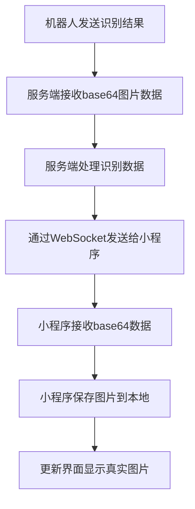

# 服务端图片传输方案

## 🎯 方案概述
服务端不再保存图片文件，而是直接将图片的base64数据传输给微信小程序，由小程序负责本地保存和显示。

## 📝 更新日志

### v2.0 (2024-12-19) - AI识别系统优化
- **🧠 AI识别提示词优化**: 升级为20年农业专家级别的专业分析系统
- **📊 新增数据字段**:
  - `marketValue`: 预估市场价值（元/斤）
  - `storageLife`: 预计储存期限（天数）
  - `grade`: 品质等级评定（Premium/Excellent/Good/Average/Poor/Reject）
  - `defects`: 具体缺陷列表数组
- **🔍 增强分析维度**:
  - 8个专业分析维度（水果类型、成熟度、健康状态、品质评分等）
  - 详细的成熟度阶段划分（0-100%，6个阶段）
  - 综合品质评分系统（外观25% + 成熟度30% + 无缺陷25% + 大小20%）
- **🤖 智能采摘策略**:
  - 7种操作建议代码（harvest_now、harvest_priority、wait_3_days等）
  - 自动优先级调整（优质水果优先采摘，低质量水果跳过）
  - 市场价值实时评估和单果价值计算
- **📈 增强日志系统**:
  - 成熟度描述函数（幼果期、生长期、转色期等）
  - 品质评估函数（优质特级、优质一级等）
  - 详细的识别结果日志输出

### v1.0 (2024-12-18) - 基础图片传输
- 初始版本，实现Base64图片传输
- 基础水果识别功能
- 本地图片缓存管理

## 🔄 数据流程



## 🛠️ 核心修改

### 1. 服务端修改 (server.py)

#### 移除静态文件服务
```python
# 注释掉图片存储目录和静态文件服务
# IMAGES_DIR = Path("fruit_images")
# IMAGES_DIR.mkdir(exist_ok=True)
# app.mount("/images", StaticFiles(directory=str(IMAGES_DIR)), name="images")
```

#### 修改图片处理逻辑
```python
async def handle_fruit_detection_result(robot_id, message):
    """处理水果识别结果"""
    try:
        detection_data = message.get("data", {})
        timestamp = message.get("timestamp", int(time.time() * 1000))
        
        # 处理图片数据 - 直接传输base64数据给小程序
        image_base64 = None
        if "image_base64" in detection_data and detection_data["image_base64"]:
            try:
                # 保留原始的base64数据，让小程序自己处理
                image_base64 = detection_data["image_base64"]
                
                # 生成唯一的图片ID，供小程序保存时使用
                image_id = f"fruit_{robot_id}_{timestamp}"
                
                # 更新detection_data，传递base64数据而不是URL
                detection_data["imageBase64"] = image_base64  # 图片的base64数据
                detection_data["imageId"] = image_id  # 图片唯一标识
                detection_data["imageFormat"] = "jpg"  # 图片格式
                
                logger.info(f"图片base64数据准备完成，ID: {image_id}, 大小: {len(image_base64)} 字符")
                
            except Exception as e:
                logger.error(f"处理图片base64数据失败: {e}")
                image_base64 = None
        
        # ... 其他处理逻辑
```

### 2. 微信小程序修改 (detection.js)

#### 新增base64图片保存功能
```javascript
/**
 * 保存base64图片数据到本地
 * @param {Object} result - 识别结果对象
 * @returns {Promise<string>} 保存后的本地路径
 */
saveBase64ImageToLocal: function(result) {
  return new Promise((resolve, reject) => {
    if (!result.imageBase64) {
      reject(new Error('没有图片数据'));
      return;
    }

    try {
      // 生成本地文件名
      const fileName = `${result.imageId}.${result.imageFormat}`;
      const tempFilePath = `${wx.env.USER_DATA_PATH}/${fileName}`;
      
      // 将base64数据写入临时文件
      const fs = wx.getFileSystemManager();
      
      // 移除base64前缀（如果有）
      let base64Data = result.imageBase64;
      if (base64Data.startsWith('data:')) {
        base64Data = base64Data.split(',')[1];
      }
      
      // 写入文件
      fs.writeFile({
        filePath: tempFilePath,
        data: base64Data,
        encoding: 'base64',
        success: (res) => {
          // 保存到永久存储
          wx.saveFile({
            tempFilePath: tempFilePath,
            success: (saveRes) => {
              // 更新本地图片记录
              this.updateLocalImageRecord(fileName, saveRes.savedFilePath, result);
              resolve(saveRes.savedFilePath);
            },
            fail: (saveError) => {
              // 即使永久保存失败，也可以使用临时路径
              resolve(tempFilePath);
            }
          });
        },
        fail: (writeError) => {
          reject(writeError);
        }
      });
      
    } catch (error) {
      reject(error);
    }
  });
}
```

#### 修改识别结果处理
```javascript
formatServerDetectionResult: function(serverData) {
  // ... 其他处理逻辑
  
  const result = {
    // ... 其他字段
    imageBase64: data.imageBase64 || '',  // 服务器传来的base64数据
    imageId: data.imageId || detectionId,  // 图片唯一标识
    imageFormat: data.imageFormat || 'jpg',  // 图片格式
    imageUrl: '',  // 初始为空，保存后会更新
    isLocalImage: true,  // 标记为本地图片
    needsSaveImage: !!data.imageBase64  // 是否需要保存图片
  };
  
  // 如果有base64图片数据，保存到本地
  if (result.needsSaveImage) {
    this.saveBase64ImageToLocal(result).then(savedPath => {
      // 更新历史记录中的图片路径
      this.updateImagePathInHistory(result.id, savedPath);
    }).catch(error => {
      // 使用预设图片作为备选
      const fallbackPath = this.getLocalFruitImage(result.fruitType);
      this.updateImagePathInHistory(result.id, fallbackPath);
    });
  }
  
  return result;
}
```

## 📊 数据格式

### 服务端发送格式 (v2.0)
```json
{
  "type": "fruit_detection_result",
  "data": {
    "fruitType": "嘎啦苹果",
    "maturity": 85,
    "qualityScore": 88,
    "grade": "Excellent",
    "confidence": 92,
    "healthStatus": "完全健康",
    "sizeCategory": "大",
    "recommendation": "果实成熟度高，外观无显著缺陷，建议优先采摘",
    "suggestedAction": "harvest_priority",
    "defects": [],
    "estimatedWeight": 180,
    "ripeness_days": 0,
    "marketValue": 4.5,
    "storageLife": 15,
    "imageBase64": "/9j/4AAQSkZJRgABAQAAAQABAAD/2wBDAAYEBQYFBAYGBQYHBwYIChAKCgkJChQODwwQFxQYGBcUFhYaHSUfGhsjHBYWICwgIyYnKSopGR8tMC0oMCUoKSj/2wBDAQcHBwoIChMKChMoGhYaKCgoKCgoKCgoKCgoKCgoKCgoKCgoKCgoKCgoKCgoKCgoKCgoKCgoKCgoKCgoKCgoKCj/wAARCAABAAEDASIAAhEBAxEB/8QAFQABAQAAAAAAAAAAAAAAAAAAAAv/xAAUEAEAAAAAAAAAAAAAAAAAAAAA/8QAFQEBAQAAAAAAAAAAAAAAAAAAAAX/xAAUEQEAAAAAAAAAAAAAAAAAAAAA/9oADAMBAAIRAxEAPwCdABmX/9k=",
    "imageId": "fruit_robot_123_1749906247486",
    "imageFormat": "jpg",
    "timestamp": 1749906247486,
    "detectionTime": "09:04",
    "location": "苹果园区3号地块 I-94 区域",
    "actionTaken": "优先采摘"
  },
  "timestamp": 1749906247486
}
```

#### 新增字段说明
- **`grade`**: 品质等级 (Premium/Excellent/Good/Average/Poor/Reject)
- **`defects`**: 缺陷列表数组，如 `["轻微划痕", "小斑点"]`
- **`estimatedWeight`**: 估算重量（克）
- **`ripeness_days`**: 距最佳采摘期天数（负数表示已过期）
- **`marketValue`**: 预估市场价值（元/斤）
- **`storageLife`**: 预计储存期限（天数）
- **`suggestedAction`**: 操作建议代码
  - `harvest_now`: 立即采摘
  - `harvest_priority`: 优先采摘
  - `harvest_normal`: 正常采摘
  - `wait_3_days`: 等待3天
  - `wait_week`: 等待一周
  - `inspect_closely`: 需要检查
  - `reject`: 拒绝采摘

### 小程序本地存储格式
```json
{
  "id": "detection_1749906247486_00005_2x7xuds15",
  "fruitType": "嘎啦苹果",
  "imageUrl": "wxfile://tmp_xxx/fruit_robot_123_1749906247486.jpg",
  "localImagePath": "wxfile://tmp_xxx/fruit_robot_123_1749906247486.jpg",
  "isLocalImage": true,
  "imageName": "服务器图片",
  "timestamp": 1749906247486
}
```

## 🎯 优势分析

| 特性 | 之前方案 | 新方案 ✅ |
|------|----------|----------|
| 服务端复杂度 | 需要文件管理 | 简单数据传输 |
| 网络配置 | 需要IP配置 | 无需配置 |
| 图片访问 | 依赖网络请求 | 本地直接访问 |
| 存储管理 | 服务端存储 | 小程序本地管理 |
| 离线可用性 | 不支持 | 完全支持 |
| 传输效率 | 需要二次请求 | 一次传输完成 |

## 🔧 使用步骤

### 1. 更新服务端代码
- 注释掉静态文件服务相关代码
- 修改 `handle_fruit_detection_result` 函数
- 确保传输 `imageBase64`、`imageId`、`imageFormat` 字段

### 2. 更新小程序代码
- 添加 `saveBase64ImageToLocal` 函数
- 修改 `formatServerDetectionResult` 函数
- 添加图片缓存管理功能

### 3. 测试验证
```javascript
// 在小程序控制台测试
const page = getCurrentPages()[0];
console.log('本地图片列表:', page.getLocalImageList());
```

## 📱 界面效果

### 显示特征
- ✅ 真实的水果图片（来自服务端）
- ✅ "本地"标识显示
- ✅ 快速加载，无网络延迟
- ✅ 离线可用

### 调试信息
```
服务器图片处理:
- 水果类型: 嘎啦苹果
- 是否有base64数据: true
- 图片ID: fruit_robot_123_1749906247486
- 格式化完成 - 最终结果fruitType: 嘎啦苹果

开始保存图片到本地: fruit_robot_123_1749906247486.jpg
图片写入成功: wxfile://tmp_xxx/fruit_robot_123_1749906247486.jpg
图片保存到永久存储成功: wxfile://store_xxx/fruit_robot_123_1749906247486.jpg
更新记录 detection_xxx 的图片路径: wxfile://store_xxx/fruit_robot_123_1749906247486.jpg
```

## 🛠️ 维护功能

### 自动清理
- 7天后自动删除过期图片
- 限制最大保存50张图片
- 页面加载时自动清理

### 手动管理
```javascript
// 获取本地图片列表
const images = page.getLocalImageList();

// 手动清理过期图片
page.cleanupLocalImages();

// 查看存储使用情况
console.log(`当前保存了 ${images.length} 张图片`);
```

## 🚀 部署说明

1. **服务端部署**：
   - 更新 `server.py` 文件
   - 重启服务端程序
   - 验证不再创建 `fruit_images` 目录

2. **小程序部署**：
   - 更新 `detection.js` 文件
   - 重新编译小程序
   - 测试图片接收和保存功能

3. **验证效果**：
   - 发送测试识别结果
   - 检查小程序是否显示真实图片
   - 确认图片保存到本地存储

现在您的系统将完全通过base64数据传输图片，服务端更简洁，小程序显示真实图片！ 