# 服务端图片传输方案

## 🎯 方案概述
服务端不再保存图片文件，而是直接将图片的base64数据传输给微信小程序，由小程序负责本地保存和显示。

## 🔄 数据流程

```mermaid
graph TD
    A[机器人发送识别结果] --> B[服务端接收base64图片数据]
    B --> C[服务端处理识别数据]
    C --> D[通过WebSocket发送给小程序]
    D --> E[小程序接收base64数据]
    E --> F[小程序保存图片到本地]
    F --> G[更新界面显示真实图片]
```



## 🛠️ 核心修改

### 1. 服务端修改 (server.py)

#### 移除静态文件服务
```python
# 注释掉图片存储目录和静态文件服务
# IMAGES_DIR = Path("fruit_images")
# IMAGES_DIR.mkdir(exist_ok=True)
# app.mount("/images", StaticFiles(directory=str(IMAGES_DIR)), name="images")
```

#### 修改图片处理逻辑
```python
async def handle_fruit_detection_result(robot_id, message):
    """处理水果识别结果"""
    try:
        detection_data = message.get("data", {})
        timestamp = message.get("timestamp", int(time.time() * 1000))
        
        # 处理图片数据 - 直接传输base64数据给小程序
        image_base64 = None
        if "image_base64" in detection_data and detection_data["image_base64"]:
            try:
                # 保留原始的base64数据，让小程序自己处理
                image_base64 = detection_data["image_base64"]
                
                # 生成唯一的图片ID，供小程序保存时使用
                image_id = f"fruit_{robot_id}_{timestamp}"
                
                # 更新detection_data，传递base64数据而不是URL
                detection_data["imageBase64"] = image_base64  # 图片的base64数据
                detection_data["imageId"] = image_id  # 图片唯一标识
                detection_data["imageFormat"] = "jpg"  # 图片格式
                
                logger.info(f"图片base64数据准备完成，ID: {image_id}, 大小: {len(image_base64)} 字符")
                
            except Exception as e:
                logger.error(f"处理图片base64数据失败: {e}")
                image_base64 = None
        
        # ... 其他处理逻辑
```

### 2. 微信小程序修改 (detection.js)

#### 新增base64图片保存功能
```javascript
/**
 * 保存base64图片数据到本地
 * @param {Object} result - 识别结果对象
 * @returns {Promise<string>} 保存后的本地路径
 */
saveBase64ImageToLocal: function(result) {
  return new Promise((resolve, reject) => {
    if (!result.imageBase64) {
      reject(new Error('没有图片数据'));
      return;
    }

    try {
      // 生成本地文件名
      const fileName = `${result.imageId}.${result.imageFormat}`;
      const tempFilePath = `${wx.env.USER_DATA_PATH}/${fileName}`;
      
      // 将base64数据写入临时文件
      const fs = wx.getFileSystemManager();
      
      // 移除base64前缀（如果有）
      let base64Data = result.imageBase64;
      if (base64Data.startsWith('data:')) {
        base64Data = base64Data.split(',')[1];
      }
      
      // 写入文件
      fs.writeFile({
        filePath: tempFilePath,
        data: base64Data,
        encoding: 'base64',
        success: (res) => {
          // 保存到永久存储
          wx.saveFile({
            tempFilePath: tempFilePath,
            success: (saveRes) => {
              // 更新本地图片记录
              this.updateLocalImageRecord(fileName, saveRes.savedFilePath, result);
              resolve(saveRes.savedFilePath);
            },
            fail: (saveError) => {
              // 即使永久保存失败，也可以使用临时路径
              resolve(tempFilePath);
            }
          });
        },
        fail: (writeError) => {
          reject(writeError);
        }
      });
      
    } catch (error) {
      reject(error);
    }
  });
}
```

#### 修改识别结果处理
```javascript
formatServerDetectionResult: function(serverData) {
  // ... 其他处理逻辑
  
  const result = {
    // ... 其他字段
    imageBase64: data.imageBase64 || '',  // 服务器传来的base64数据
    imageId: data.imageId || detectionId,  // 图片唯一标识
    imageFormat: data.imageFormat || 'jpg',  // 图片格式
    imageUrl: '',  // 初始为空，保存后会更新
    isLocalImage: true,  // 标记为本地图片
    needsSaveImage: !!data.imageBase64  // 是否需要保存图片
  };
  
  // 如果有base64图片数据，保存到本地
  if (result.needsSaveImage) {
    this.saveBase64ImageToLocal(result).then(savedPath => {
      // 更新历史记录中的图片路径
      this.updateImagePathInHistory(result.id, savedPath);
    }).catch(error => {
      // 使用预设图片作为备选
      const fallbackPath = this.getLocalFruitImage(result.fruitType);
      this.updateImagePathInHistory(result.id, fallbackPath);
    });
  }
  
  return result;
}
```

## 📊 数据格式

### 服务端发送格式
```json
{
  "type": "fruit_detection_result",
  "data": {
    "fruitType": "嘎啦苹果",
    "maturity": 85,
    "qualityScore": 80,
    "confidence": 90,
    "healthStatus": "健康",
    "recommendation": "果实成熟度高，外观无显著缺陷，建议采摘",
    "imageBase64": "/9j/4AAQSkZJRgABAQAAAQABAAD/2wBDAAYEBQYFBAYGBQYHBwYIChAKCgkJChQODwwQFxQYGBcUFhYaHSUfGhsjHBYWICwgIyYnKSopGR8tMC0oMCUoKSj/2wBDAQcHBwoIChMKChMoGhYaKCgoKCgoKCgoKCgoKCgoKCgoKCgoKCgoKCgoKCgoKCgoKCgoKCgoKCgoKCgoKCgoKCj/wAARCAABAAEDASIAAhEBAxEB/8QAFQABAQAAAAAAAAAAAAAAAAAAAAv/xAAUEAEAAAAAAAAAAAAAAAAAAAAA/8QAFQEBAQAAAAAAAAAAAAAAAAAAAAX/xAAUEQEAAAAAAAAAAAAAAAAAAAAA/9oADAMBAAIRAxEAPwCdABmX/9k=",
    "imageId": "fruit_robot_123_1749906247486",
    "imageFormat": "jpg",
    "timestamp": 1749906247486,
    "detectionTime": "09:04",
    "location": "苹果园区3号地块 I-94 区域"
  },
  "timestamp": 1749906247486
}
```

### 小程序本地存储格式
```json
{
  "id": "detection_1749906247486_00005_2x7xuds15",
  "fruitType": "嘎啦苹果",
  "imageUrl": "wxfile://tmp_xxx/fruit_robot_123_1749906247486.jpg",
  "localImagePath": "wxfile://tmp_xxx/fruit_robot_123_1749906247486.jpg",
  "isLocalImage": true,
  "imageName": "服务器图片",
  "timestamp": 1749906247486
}
```

## 🎯 优势分析

| 特性 | 之前方案 | 新方案 ✅ |
|------|----------|----------|
| 服务端复杂度 | 需要文件管理 | 简单数据传输 |
| 网络配置 | 需要IP配置 | 无需配置 |
| 图片访问 | 依赖网络请求 | 本地直接访问 |
| 存储管理 | 服务端存储 | 小程序本地管理 |
| 离线可用性 | 不支持 | 完全支持 |
| 传输效率 | 需要二次请求 | 一次传输完成 |

## 🔧 使用步骤

### 1. 更新服务端代码
- 注释掉静态文件服务相关代码
- 修改 `handle_fruit_detection_result` 函数
- 确保传输 `imageBase64`、`imageId`、`imageFormat` 字段

### 2. 更新小程序代码
- 添加 `saveBase64ImageToLocal` 函数
- 修改 `formatServerDetectionResult` 函数
- 添加图片缓存管理功能

### 3. 测试验证
```javascript
// 在小程序控制台测试
const page = getCurrentPages()[0];
console.log('本地图片列表:', page.getLocalImageList());
```

## 📱 界面效果

### 显示特征
- ✅ 真实的水果图片（来自服务端）
- ✅ "本地"标识显示
- ✅ 快速加载，无网络延迟
- ✅ 离线可用

### 调试信息
```
服务器图片处理:
- 水果类型: 嘎啦苹果
- 是否有base64数据: true
- 图片ID: fruit_robot_123_1749906247486
- 格式化完成 - 最终结果fruitType: 嘎啦苹果

开始保存图片到本地: fruit_robot_123_1749906247486.jpg
图片写入成功: wxfile://tmp_xxx/fruit_robot_123_1749906247486.jpg
图片保存到永久存储成功: wxfile://store_xxx/fruit_robot_123_1749906247486.jpg
更新记录 detection_xxx 的图片路径: wxfile://store_xxx/fruit_robot_123_1749906247486.jpg
```

## 🛠️ 维护功能

### 自动清理
- 7天后自动删除过期图片
- 限制最大保存50张图片
- 页面加载时自动清理

### 手动管理
```javascript
// 获取本地图片列表
const images = page.getLocalImageList();

// 手动清理过期图片
page.cleanupLocalImages();

// 查看存储使用情况
console.log(`当前保存了 ${images.length} 张图片`);
```

## 🚀 部署说明

1. **服务端部署**：
   - 更新 `server.py` 文件
   - 重启服务端程序
   - 验证不再创建 `fruit_images` 目录

2. **小程序部署**：
   - 更新 `detection.js` 文件
   - 重新编译小程序
   - 测试图片接收和保存功能

3. **验证效果**：
   - 发送测试识别结果
   - 检查小程序是否显示真实图片
   - 确认图片保存到本地存储

现在您的系统将完全通过base64数据传输图片，服务端更简洁，小程序显示真实图片！ 